# PhenoPixel5.0
An OpenCV Based High-throughput image analysis program (API)

[日本語ドキュメント](README_JA.md)

# Old version 

This version 5.0 inherits the deprecated version [PhenoPixel 4.0](https://github.com/ikeda042/PhenoPixel4.0)

# Setup 

This program presupposes that Node.js and Python 3.10 are installed on the user's computer


## start up back-end

```bash
cd backend/app
pip install -r requiremetns.txt
```

start up command 

```bash
python main.py
```

## start up front-end

```bash
cd frontend
npm start
```

# User Interface

The startup screen shows up after activating the front end. 
   
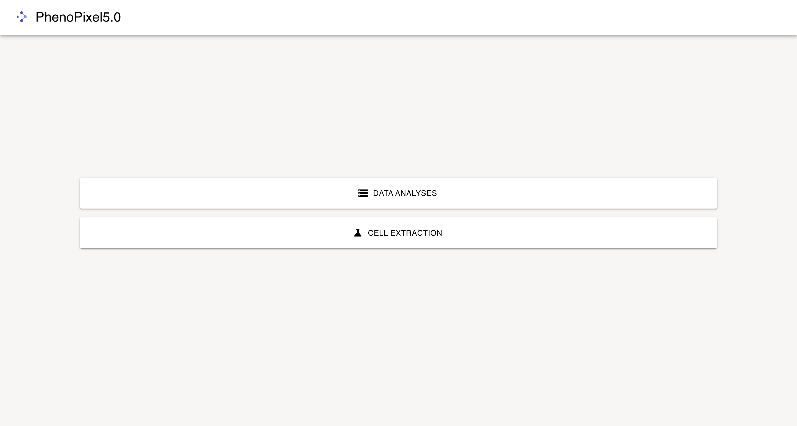

## Cell Extraction

This section allows you to extract cells from arbitrary ND2 files that consist of up to three layers (e.g., PH, GFP, and YFP).

1. The first thing you will see in this section is the ND2 table shown below.
   
   First, you need to upload an ND2 file from your computer using the `SELECT ND2 FILE` button.
   

2. After selecting an ND2 file to upload, press the `UPLOAD` button to actually submit the file to the backend. This process takes approximately 30 seconds.
   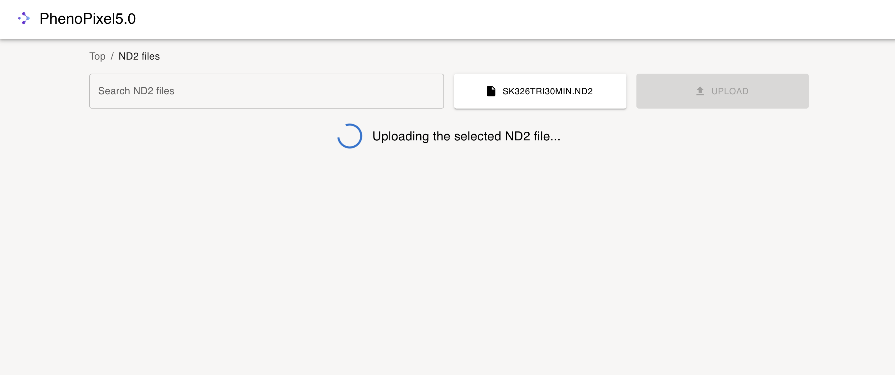
   If the file is successfully submitted, a pop-up alert will appear like this, and the filename will be added to the list as well.
   

3. The next step is to press the `EXTRACT CELLS` button.
   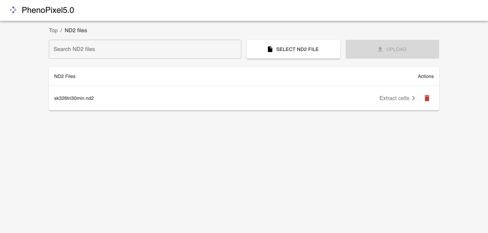

4. After entering the cell extraction section, you will see the parameter input fields.
   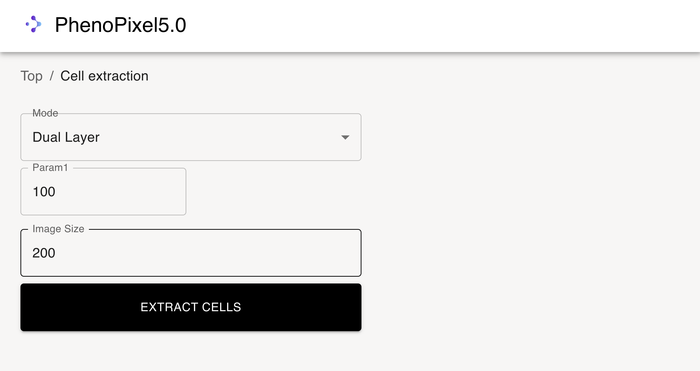
   Press the `EXTRACT CELLS` button when you have finished inputting all the parameters, and the cell extraction process will begin on the backend. This will take approximately 1 minute.

   <!-- Add parameter descriptions here. -->
5. When all processes are finished, detected cell contours will appear on the PH image with frames extracted from the input ND2 file. This is where you can check if the contour detection was successful. If not, you can adjust the parameters and press the `RE-EXTRACT CELLS` button. If everything looks fine, press the `GO TO DATABASE` button to proceed to the next step, which is labeling each cell.
   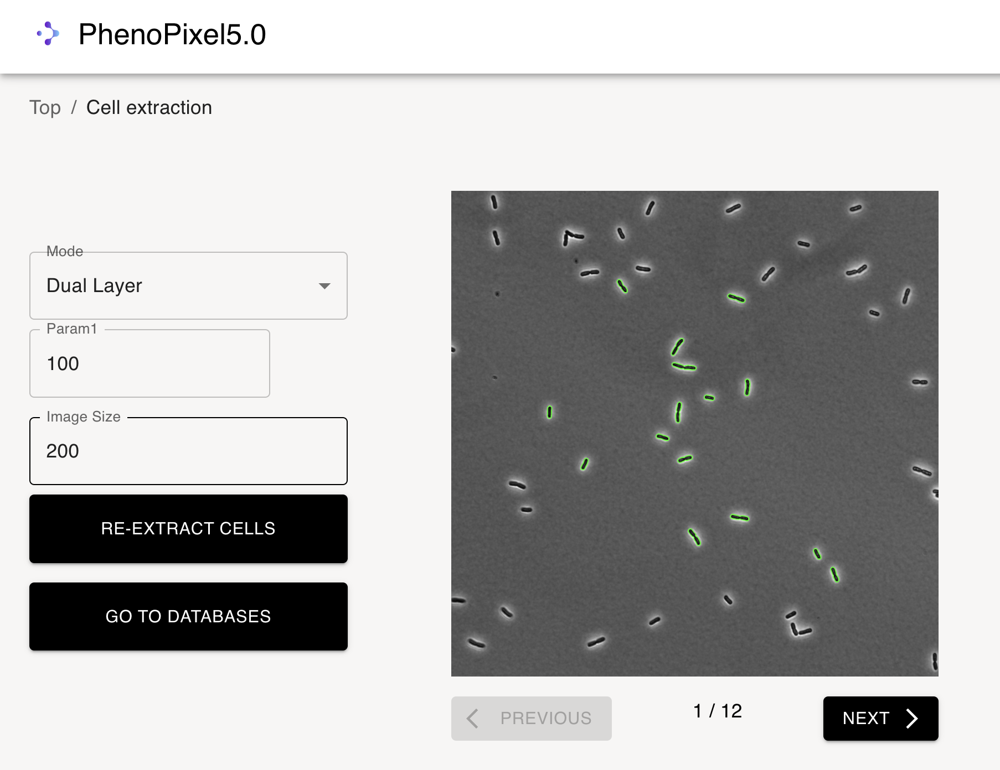

6. After moving on to the section below the cell extraction section, you can access the database with the same prefix as the input ND2 file. The automatically generated database contains all the cell information and is renamed with the postfix `-uploaded` as a tag. The `Mark as Complete` button is disabled at this point because all the extracted cells are labeled as `N/A`.
   

7. When you press the `ACCESS DATABASE` button, you will see the cell labeling section as shown below.
   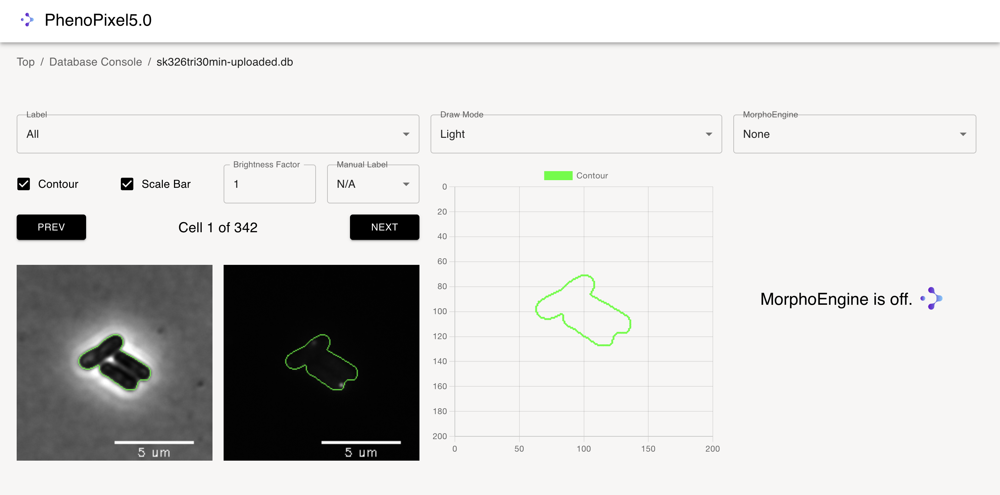
   In this section, you can label all the cells extracted from the previous section with labels ["N/A", "1", "2", "3"]. You can also input these labels from the keyboard using ["n", "1", "2", "3"], and "Enter" corresponds to the "Next" UI button. Note that labels for each cell are automatically updated on the backend as soon as you select one in the list.

8. After labeling all the cells with arbitrary labels, you can go back to the `Database console` to find that the `Mark as Complete` button is enabled. 
   
   When you mark the database as complete, the database name is renamed to a new one with `-completed` as a postfix, and the labeled databases are downloadable(i.e., press the `EXPORT DATABASE` button to download the file.)
   
   

# Data Analyses

After obtaining the cell database with selected labels for each cell, in other words, after pressing `mark as completed`, it will show up in the `completed` section of the console. (Note that the `Validated` tag is only for admin usage (i.e., uncontrollable from the frontend))
   

When you press the `Access database` button, you will go to a similar section as the cell labeling console. (It is actually the same but without the labeling function.)
   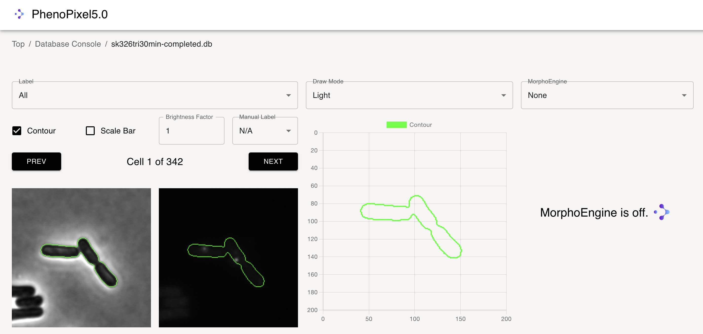

The next action you will take is to select the cells with a specific label in the list. 
   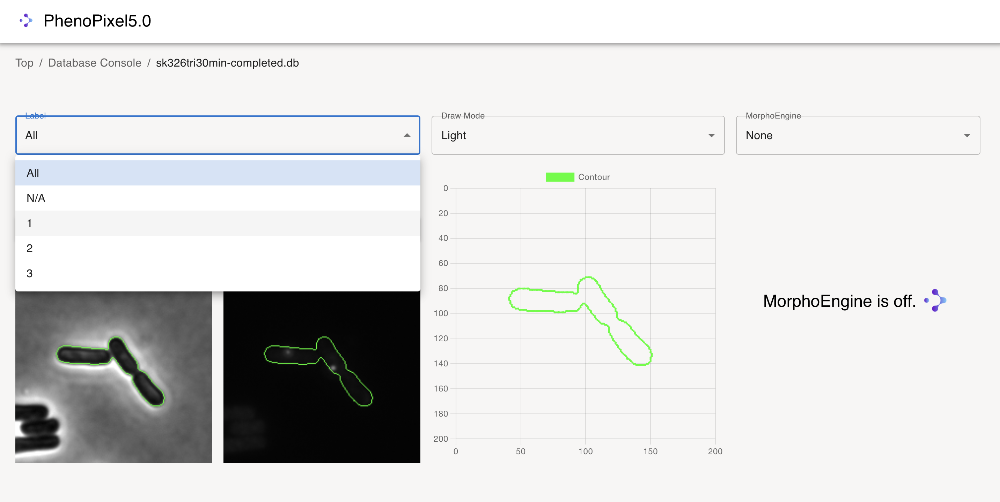

   In this example, we will be using cells labeled with `1` as shown below.
   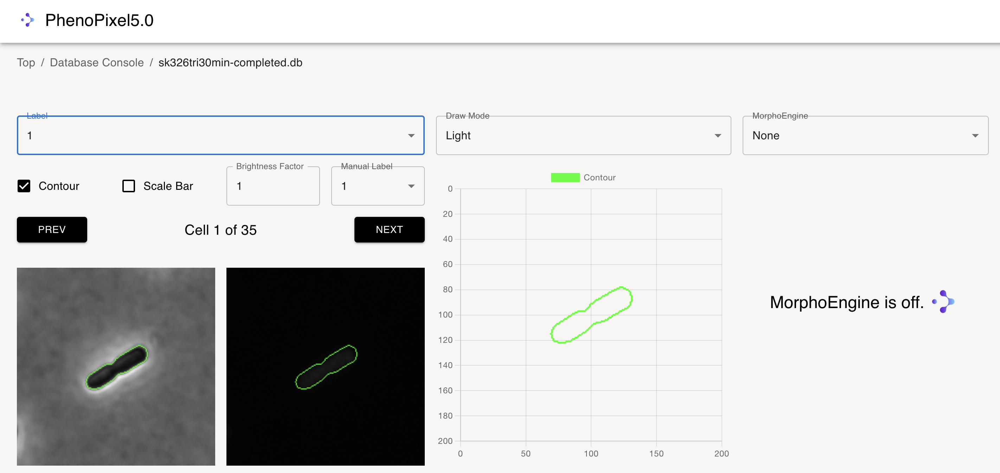

## Parameters 

If you uncheck both the `Contour` and `Scale bar` checkboxes, you will see the raw images of the cells. 
   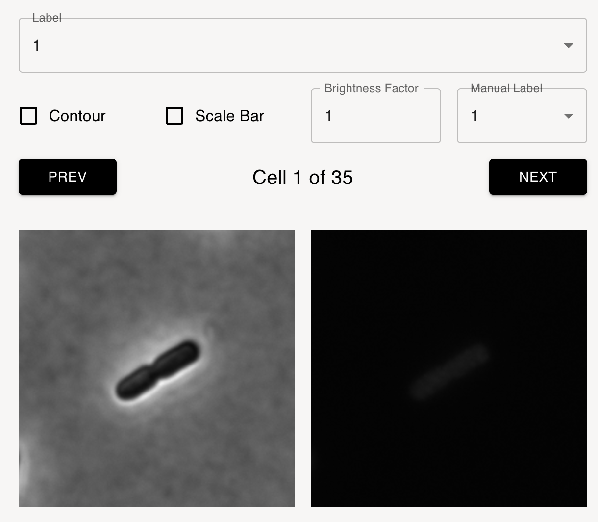

If you check both the `Contour` and `Scale bar` checkboxes, you will see the cell images with their contours and a scale bar. 
   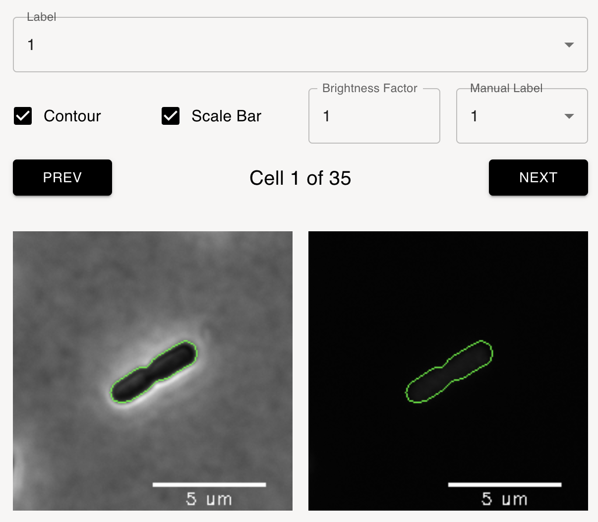

If you increase or decrease the `Brightness Factor`, you can adjust the brightness of each pixel to see the localization of the fluorescence, etc. 
   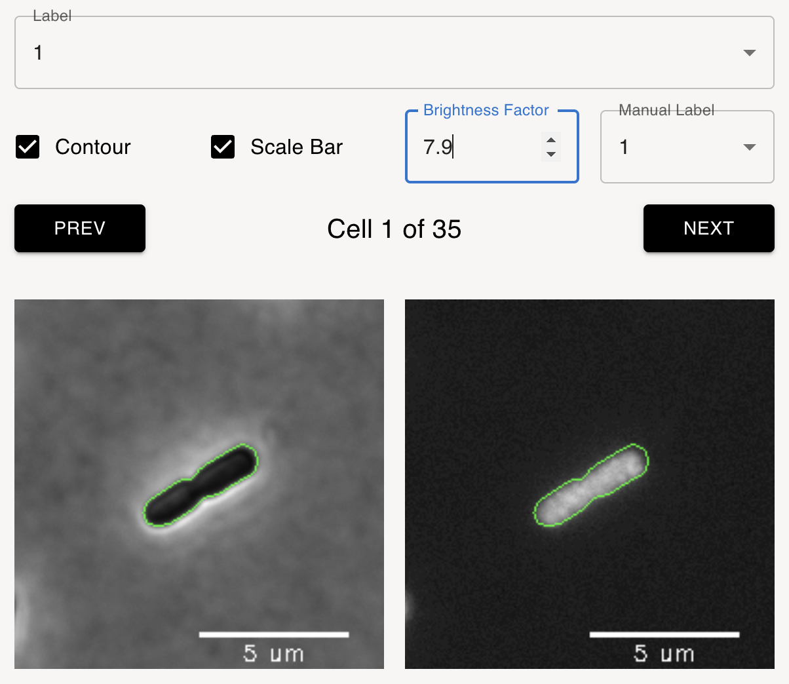

The `Manual Label` section just shows you the label of the cell and never updates it in this section because the labeling process is already done beforehand.

## Graph Section

There is a graph section in the middle column, which is set to `Light` as the default value. It shows the contour of the cell with its center at the center of the figure.
   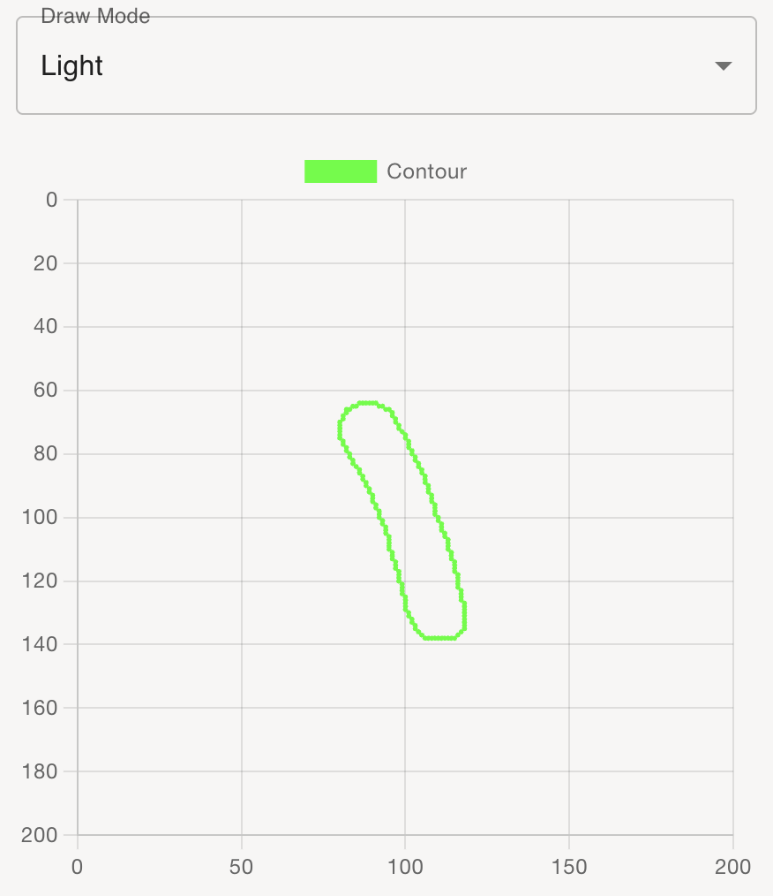

The draw modes consist of these three modes:


If you choose `Replot`, it shows the replotted figure of the cell. 

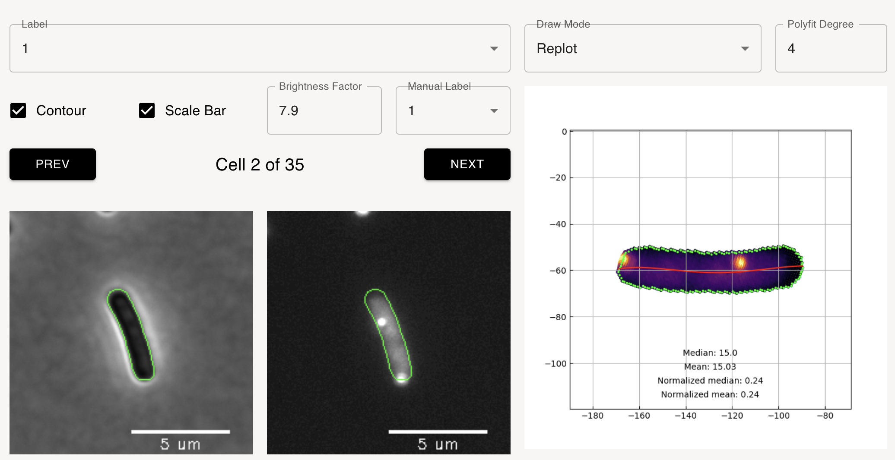

If you choose `Peak-path`, it shows the peak-path figure of the cell. 

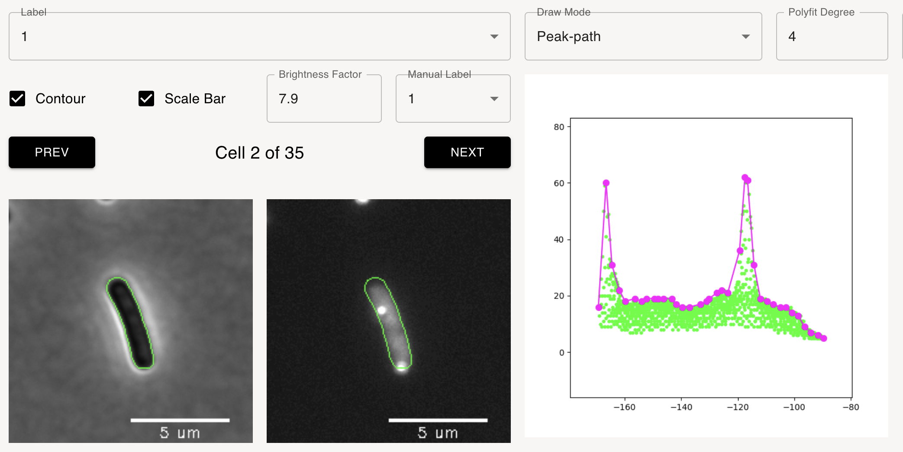

`Polyfit degree` is a meta-parameter for the polynomial fitting of the cell center curve, but it is generally good practice to leave it at four.

# Morphoengines 

There are four Morphoengines that conduct morphological analyses of the cells.


If you choose `Morphoengine 2.0`, it shows you the morphological parameters for each cell. 
(The volume calculation algorithms are a work in progress.)

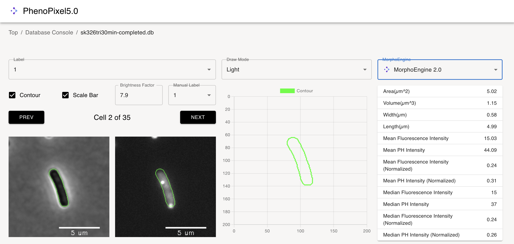

If you choose `MedianEngine`, it shows you the normalized median of the pixels inside the cell, highlighted with a red dot, and the other blue dots are those cells labeled as `1` in this case.

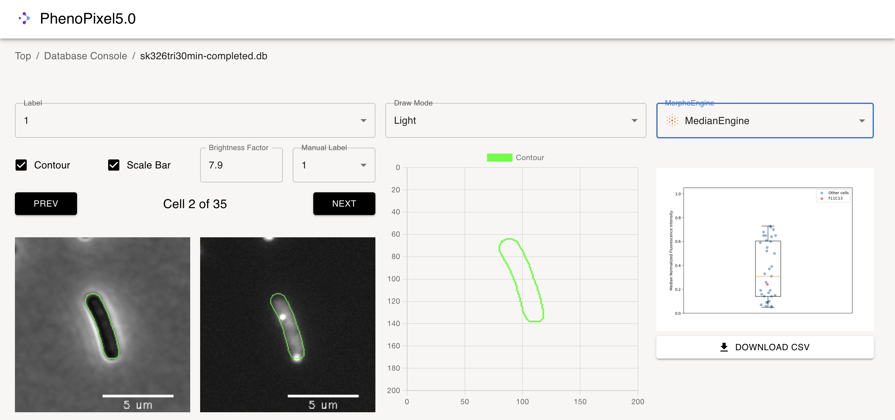

`MeanEngine` performs a similar function but for the normalized mean of the pixels inside the cells.

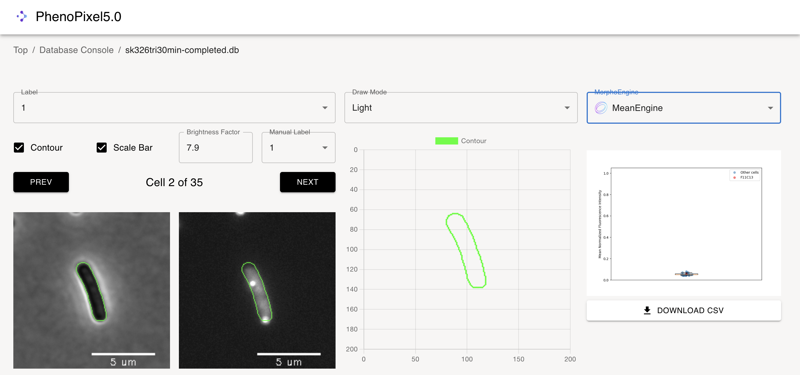

`HeatmapEngine` qualitatively visualizes the localization of the fluorescence at relative positions from the edge of the cell.

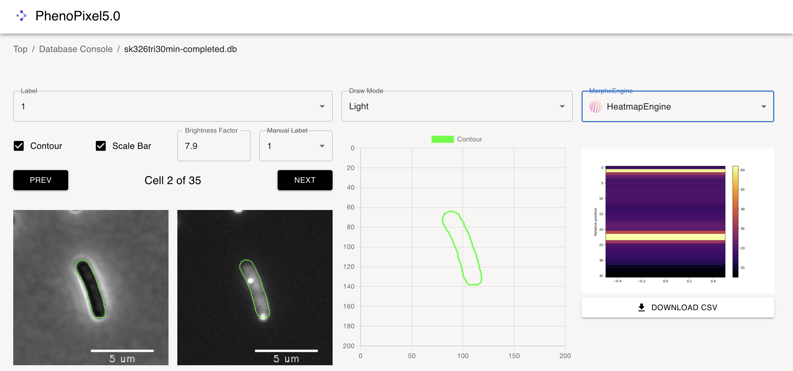


    


# Algorithms for morphological analyses 

## Cell Elongation Direction Determination Algorithm

### Objective:
To implement an algorithm for determinating the direction of cell elongation.

### Methodologies: 

In this section, we consider the elongation direction determination algorithm with regard to the cell with contour shown in Fig.1 below. 

Scale bar is 20% of image size (200x200 pixel, 0.0625 µm/pixel)


<div align="center">

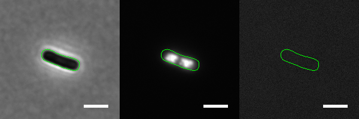  

</div>

<p align="center">
Fig.1  <i>E.coli</i> cell with its contour (PH Left, Fluo-GFP Center, Fluo-mCherry Right)
</p>

Consider each contour coordinate as a set of vectors in a two-dimensional space:

$$\mathbf{X} = 
\left(\begin{matrix}
x_1&\cdots&x_n \\
y_1&\cdots&y_n 
\end{matrix}\right)^\mathrm{T}\in \mathbb{R}^{n\times 2}$$

The covariance matrix for $\mathbf{X}$ is:

$$\Sigma =
 \begin{pmatrix} V[\mathbf{X_1}]&Cov[\mathbf{X_1},\mathbf{X_2}]
 \\ 
 Cov[\mathbf{X_1},\mathbf{X_2}]& V[\mathbf{X_2}] \end{pmatrix}$$

where $\mathbf{X_1} = (x_1\:\cdots x_n)$, $\mathbf{X_2} = (y_1\:\cdots y_n)$.

Let's define a projection matrix for linear transformation $\mathbb{R}^2 \to \mathbb{R}$  as:

$$\mathbf{w} = \begin{pmatrix}w_1&w_2\end{pmatrix}^\mathrm{T}$$

Now the variance of the projected points to $\mathbb{R}$ is written as:
$$s^2 = \mathbf{w}^\mathrm{T}\Sigma \mathbf{w}$$

Assume that maximizing this variance corresponds to the cell's major axis, i.e., the direction of elongation, we consider the maximization problem of the above equation.

To prevent divergence of variance, the norm of the projection matrix is fixed at 1. Thus, solve the following constrained maximization problem to find the projection axis:

$$arg \max (\mathbf{w}^\mathrm{T}\Sigma \mathbf{w}), \|\mathbf{w}\| = 1$$

To solve this maximization problem under the given constraints, we employ the method of Lagrange multipliers. This technique introduces an auxiliary function, known as the Lagrange function, to find the extrema of a function subject to constraints. Below is the formulation of the Lagrange multipliers method as applied to the problem:

$$\cal{L}(\mathbf{w},\lambda) = \mathbf{w}^\mathrm{T}\Sigma \mathbf{w} - \lambda(\mathbf{w}^\mathrm{T}\mathbf{w}-1)$$

At maximum variance:

$$\frac{\partial\cal{L}}{\partial{\mathbf{w}}} = 2\Sigma\mathbf{w}-2\lambda\mathbf{w} = 0$$

Hence, 

$$ \Sigma\mathbf{w}=\lambda\mathbf{w} $$

Select the eigenvector corresponding to the eigenvalue where λ1 > λ2 as the direction of cell elongation. (Longer axis)

### Result:

Figure 2 shows the raw image of an <i>E.coli </i> cell and the long axis calculated with the algorithm.


<div align="center">

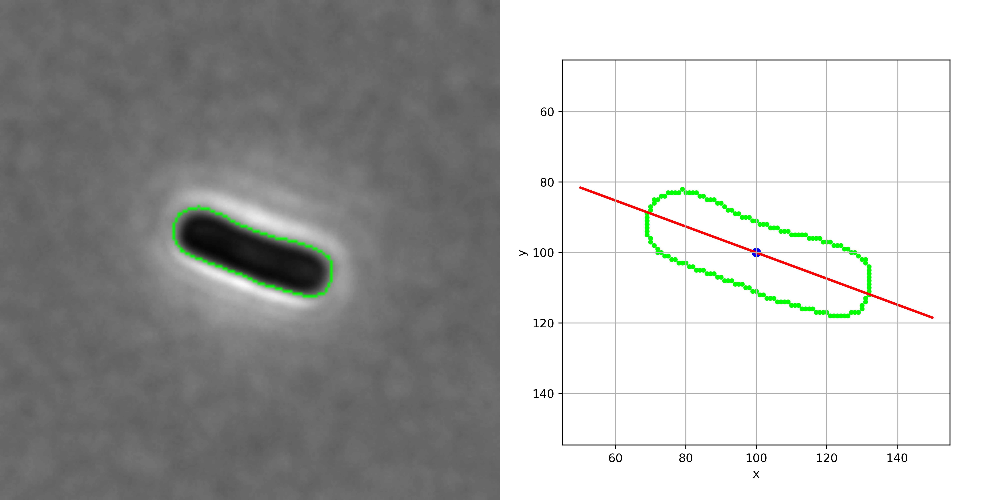  

</div>

<p align="center">
Fig.2  <i>E.coli</i> cell with its contour (PH Left, Replotted contour with the long axis Right)
</p>


## Basis conversion Algorithm

### Objective:

To implement an algorithm for replacing the basis of 2-dimentional space of the cell with the basis of the eigenspace(2-dimentional).

### Methodologies:


Let 

$$ \mathbf{Q}  = \begin{pmatrix}
    v_1&v_2
\end{pmatrix}\in \mathbb{R}^{2\times 2}$$

$$\mathbf{\Lambda} = \begin{pmatrix}
    \lambda_1& 0 \\
    0&\lambda_2
\end{pmatrix}
(\lambda_1 > \lambda_2)$$

, then the spectral factorization of Cov matrix of the contour coordinates can be writtern as:

$$\Sigma =
 \begin{pmatrix} V[\mathbf{X_1}]&Cov[\mathbf{X_1},\mathbf{X_2}]
 \\ 
 Cov[\mathbf{X_1},\mathbf{X_2}]& V[\mathbf{X_2}] \end{pmatrix} = \mathbf{Q}\mathbf{\Lambda}\mathbf{Q}^\mathrm{T}$$

Hence, arbitrary coordinates in the new basis of the eigenbectors can be written as:

$$\begin{pmatrix}
    u_1&u_2
\end{pmatrix}^\mathrm{T} = \mathbf{Q}\begin{pmatrix}
    x_1&y_1
\end{pmatrix}^\mathrm{T}$$

### Result:

Figure 3 shows contour in the new basis 

$$\begin{pmatrix}
    u_1&u_2
\end{pmatrix}$$ 

<div align="center">

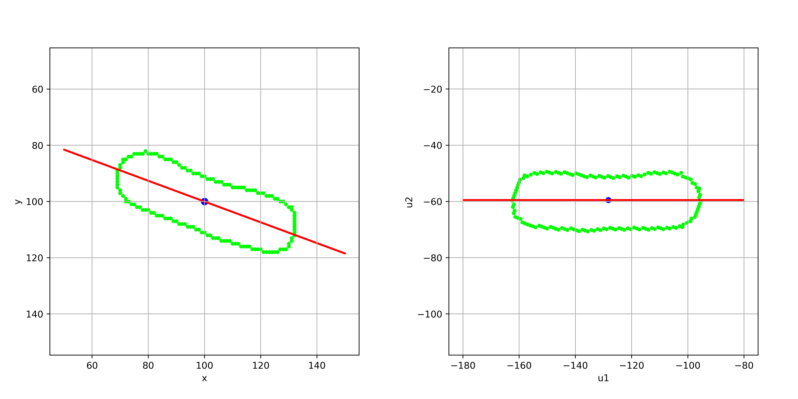  

</div>
<p align="center">
Fig.3  Each coordinate of contour in the new basis (Right). 
</p>


## Cell length calculation Algorithm

### Objective:

To implement an algorithm for calculating the cell length with respect to the center axis of the cell.

### Methodologies:

<i>E.coli</i> expresses filamentous phenotype when exposed to certain chemicals. (e.g. Ciprofloxacin)

Figure 4 shows an example of a filamentous cell with Ciprofloxacin exposure. 

<div align="center">

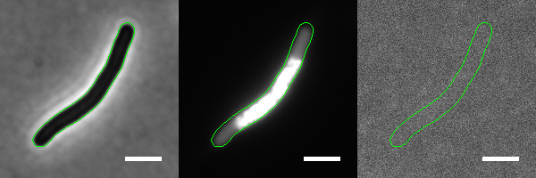  

</div>


<p align="center">
Fig.4 A filamentous <i>E.coli</i> cell (PH Left, Fluo-GFP Center, Fluo-mCherry Right).
</p>


Thus, the center axis of the cell, not necessarily straight, is required to calculate the cell length. 

Using the aforementioned basis conversion algorithm, first we converted the basis of the cell contour to its Cov matrix's eigenvectors' basis.

Figure 5 shows the coordinates of the contour in the eigenspace's bases. 


<div align="center">

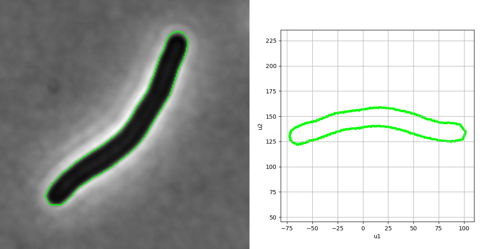  
</div>

<p align="center">
Fig.5 The coordinates of the contour in the new basis (PH Left, contour in the new basis Right).
</p>

We then applied least aquare method to the coordinates of the contour in the new basis.

Let the contour in the new basis

$$\mathbf{C} = \begin{pmatrix}
    u_{1_1} &\cdots&\ u_{1_n} \\ 
    u_{2_1} &\cdots&\ u_{2_n} 
\end{pmatrix} \in \mathbb{R}^{2\times n}$$

then regression with arbitrary k-th degree polynomial (i.e. the center axis of the cell) can be expressed as:
$$f\hat{(u_1)} = \theta^\mathrm{T} \mathbf{U}$$

where 

$$\theta = \begin{pmatrix}
    \theta_k&\cdots&\theta_0
\end{pmatrix}^\mathrm{T}\in \mathbb{R}^{k+1}$$

$$\mathbf{U} = \begin{pmatrix}
    u_1^k&\cdots u_1^0
\end{pmatrix}^\mathrm{T}$$

the parameters in theta can be determined by normal equation:

$$\theta = (\mathbf{W}^\mathrm{T}\mathbf{W})^{-1}\mathbf{W}^\mathrm{T}\mathbf{f}$$

where

$$\mathbf{W} = \begin{pmatrix}
    u_{1_1}^k&\cdots&1 \\
     \vdots&\vdots&\vdots \\
     u_{1_n}^k&\cdots&1 
\end{pmatrix} \in \mathbb{R}^{n\times k +1}$$

$$\mathbf{f} = \begin{pmatrix}
    u_{2_1}&\cdots&u_{2_n}
\end{pmatrix}^\mathrm{T}$$

Hence, we have obtained the parameters in theta for the center axis of the cell in the new basis. (fig. 6)

Now using the axis, the arc length can be calculated as:

$$\mathbf{L} = \int_{u_{1_1}}^{u_{1_2}} \sqrt{1 + (\frac{d}{du_1}\theta^\mathrm{T}\mathbf{U})^2} du_1 $$

**The length is preserved in both bases.**

We rewrite the basis conversion process as:

$$\mathbf{U} = \mathbf{Q}^\mathbf{T} \mathbf{X}$$

The inner product of any vectors in the new basis $\in \mathbb{R}^2$ is 

$$ \|\mathbf{U}\|^2 = \mathbf{U}^\mathrm{T}\mathbf{U} = (\mathbf{Q}^\mathrm{T}\mathbf{X})^\mathrm{T}\mathbf{Q}^\mathbf{T}\mathbf{X} = \mathbf{X}^\mathrm{T}\mathbf{Q}\mathbf{Q}^\mathrm{T}\mathbf{X} \in \mathbb{R}$$

Since $\mathbf{Q}$ is an orthogonal matrix, 

$$\mathbf{Q}^\mathrm{T}\mathbf{Q} = \mathbf{Q}\mathbf{Q}^\mathrm{T} = \mathbf{I}$$

Thus, 

$$\|\mathbf{U}\|^2 = \|\mathbf{X}\|^2$$

Hence <u>the length is preserved in both bases.</u> 


### Result:

Figure 6 shows the center axis of the cell in the new basis (4-th polynominal).


<div align="center">

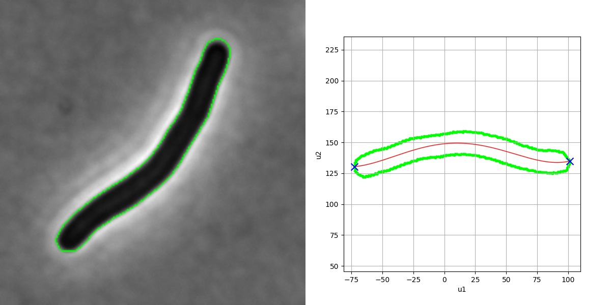  

</div>
<p align="center">
Fig.6 The center axis of the contour in the new basis (PH Left, contour in the new basis with the center axis Right).
</p>

### Choosing the Appropriate K-Value for Polynomial Regression


By default, the K-value is set to 4 in the polynomial regression. However, this may not be sufficient for accurately modeling "wriggling" cells.

For example, Figure 6-1 depicts a cell exhibiting extreme filamentous changes after exposure to Ciprofloxacin. The center axis as modeled does not adequately represent the cell's structure.

<div align="center">

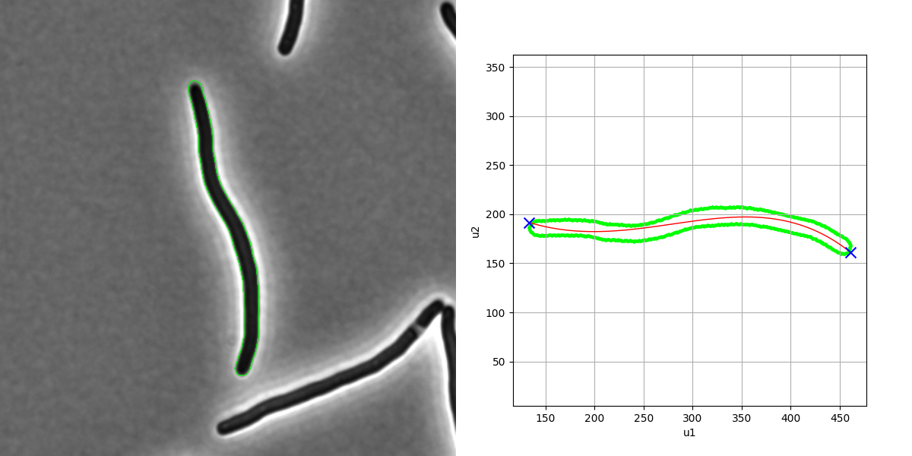  

</div>

<p align="center">
Fig.6-1  An extremely filamentous cell. (PH Left, contour in the new basis with the center axis Right).
</p>


The center axis (in red) with K = 4 does not fit as well as expected, indicating a need to explore higher K-values (i.e., K > 4) for better modeling.

Figure 6-2 demonstrates fit curves (the center axis) for K-values ranging from 5 to 10.


<div align="center">

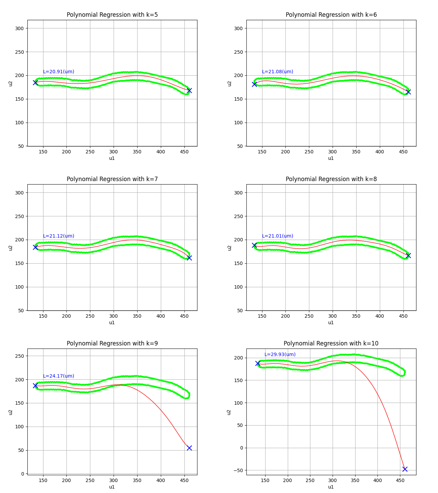

</div>
<p align="center">
Fig.6-2: Fit curves for the center axis with varying K-values (5 to 10).
</p>

As shown in Fig. 6-2, K = 8 appears to be the optimal value. 

However, it's important to note that the differences in calculated arc lengths across various K-values fall within the subpixel range.

Consequently, choosing K = 4 might remain a viable compromise in any case.


## Quantification of Localization of Fluorescence
### Objective:

To quantify the localization of fluorescence within cells.


### Methodologies:

Quantifying the localization of fluorescence is straightforward in cells with a "straight" morphology(fig. 7-1). 


<div align="center">

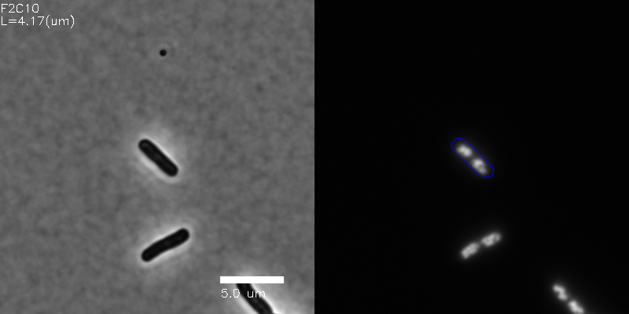  

</div>


<p align="center">
Fig.7-1: An image of an <i>E.coli</i> cell with a straight morphology.
</p>

However, challenges arise with "curved" cells(fig. 7-2).

To address this, we capitalize on our pre-established equation representing the cellular curve (specifically, a quadratic function). 

This equation allows for the precise calculation of the distance between the curve and individual pixels, which is crucial for our quantification approach.

The process begins by calculating the distance between the cellular curve and each pixel. 

This is achieved using the following formula:

An arbitrary point on the curve is described as:
$$(u_1,\theta^\mathrm{T}\mathbf{U}) $$
The minimal distance between this curve and each pixel, denoted as 
$(p_i,q_i)$, is calculated using the distance formula:

$$D_i(u_1) = \sqrt{(u_1-p_i)^2+(f\hat{(u_1)} - q_i)^2}$$

Minimizing $D_i$ with respect to $u_1$ ensures orthogonality between the curve and the line segment joining $(u_1,\theta^\mathrm{T}\mathbf{U})$ and $(p_i,q_i)$ 

This orthogonality condition is satisfied when the derivative of $D_i$ with respect to $u_1$ is zero.

The optimal value of $u_1$, denoted as $u_{1_i}^\star$, is obtained by solving 

$$\frac{d}{du_1}D_i = 0\:\forall i$$

for each pixel  $(p_i,q_i)$. 

Define the set of solution vectors as 
$$\mathbf{U}^\star = \lbrace (u_{1_i}^\star,f\hat{(u_{1_i}^\star)})^\mathrm{T} : u_{1_i}^\star \in u_1 \rbrace \in \mathbb{R}^{2\times n}$$

, where $f\hat{(u_{1_i}^\star)}$ denotes the correspoinding function value.


It should be noted that the vectors in $\mathbf{U}^\star$ can be interpreted as the projections of the pixels $(p_i,q_i)$ onto the curve.

Define the set of projected vectors $\mathbf{P}^\star$ such that each vector in this set consists of the optimal parameter value $u_{1_i}^\star$ and the corresponding fluorescence intensity, denoted by $G(p_i,q_i)$, at the pixel $(p_i,q_i)$. 

$$\mathbf{P}^\star = \lbrace (u_{1_i}^\star,G(p_i,q_i))^\mathrm{T} : u_{1_i}^\star \in u_1 \rbrace \in \mathbb{R}^{2\times n}$$


**Peak Path Finder Algorithm**

Upon deriving the set $\mathbf{P}^\star$, our next objective is to delineate a trajectory that traverses the 'peak' regions of this set. This trajectory is aimed at encapsulating the essential characteristics of each vector in $\mathbf{P}^\star$ while reducing the data complexity. 

To achieve this, we propose an algorithm that identifies critical points along the 'peak' trajectory. 

Initially, we establish a procedure to partition the curve into several segments. Consider the length of each segment to be $\Delta L_i$. The total number of segments, denoted as $n$, is determined by the condition that the sum of the lengths of all segments equals the arc length of the curve between two points $u_{1_1}$ and $u_{1_2}$. 

$$\sum_{i=0}^n \Delta L_i = \int_{u_{1_1}}^{u_{1_2}} \sqrt{1 + (\frac{d}{du_1}\theta^\mathrm{T}\mathbf{U})^2} du_1$$

Utilizing the determined number of segments $n$, we develop an algorithm designed to identify, within each segment $\Delta L_i$, a vector from the set $\mathbf{P}^\star$ that exhibits the maximum value of the function $G(p_i,q_i)$. 

The algorithm proceeds as follows:
        
> $f\to void$<br>
> for $i$ $\in$ $n$:<br>
> &nbsp;&nbsp;&nbsp;&nbsp;Define segment boundaries: $L_i$, $L_{i+1}$<br>
> &nbsp;&nbsp;&nbsp;&nbsp;Initialize: <br>
> &nbsp;&nbsp;&nbsp;&nbsp;&nbsp;&nbsp;&nbsp;&nbsp;maxValue 
> $\leftarrow -\infty$<br>
>  &nbsp;&nbsp;&nbsp;&nbsp;&nbsp;&nbsp;&nbsp;&nbsp;maxVector $\leftarrow \phi$ <br>
> &nbsp;&nbsp;&nbsp;&nbsp;for $\mathbf{v} \in \mathbf{P}^\star$ within $(L_i, L_{i+1})$:<br>
> &nbsp;&nbsp;&nbsp;&nbsp;&nbsp;&nbsp;&nbsp;&nbsp;if $G(p_i, q_i)$ of $\mathbf{v}$ > maxValue:<br>
> &nbsp;&nbsp;&nbsp;&nbsp;&nbsp;&nbsp;&nbsp;&nbsp;&nbsp;&nbsp;&nbsp;&nbsp;maxValue $\leftarrow G(p_i, q_i)$ of $\mathbf{v}$<br>
> &nbsp;&nbsp;&nbsp;&nbsp;&nbsp;&nbsp;&nbsp;&nbsp;&nbsp;&nbsp;&nbsp;&nbsp;maxVector $\leftarrow \mathbf{v}$<br>
> if maxVector $\neq \phi$ :<br>
> &nbsp;&nbsp;&nbsp;&nbsp;Add maxVector to the result set

### Result:
We applied the aforementioned algorithm for the cell shown in figure 7-2.


<div align="center">

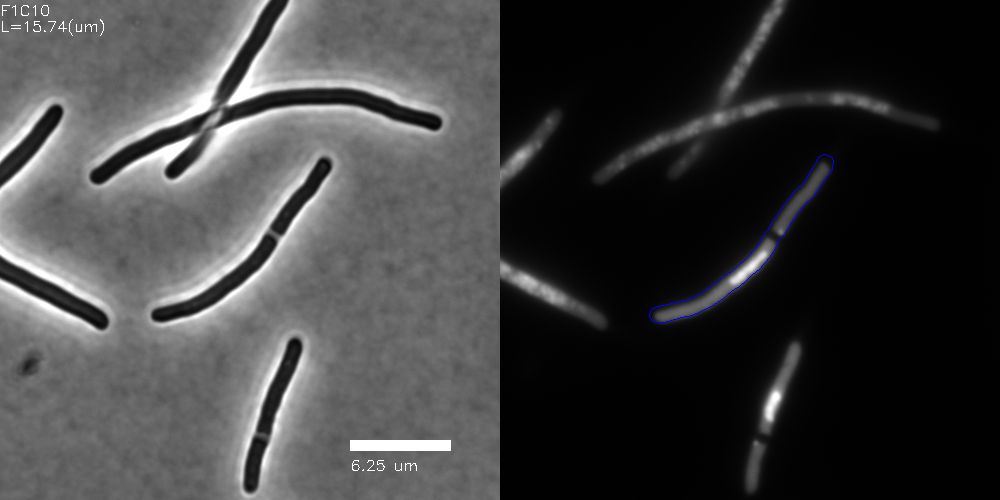  

</div>


<p align="center">
Fig.7-2: An image of a "curved" <i>E.coli</i> cell.
</p>

Figure 7-3 shows all the projected points on the center curve.

<div align="center">

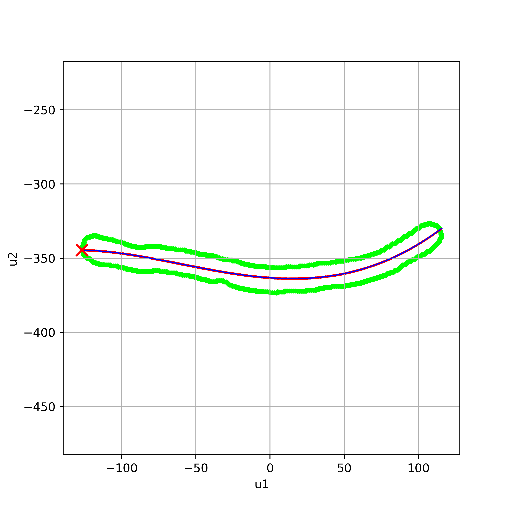  
</div>
<p align="center">
Fig.7-3: All the points(red) projected onto the center curve(blue).
</p>

Figure 7-4 depicts the result of projection onto the curve.

<div align="center">

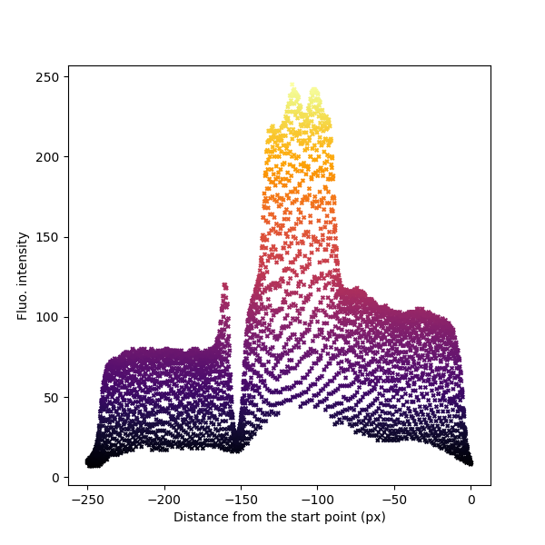  
</div>
<p align="center">
Fig.7-4: Projected points (red) onto the center curve.
</p>


Figure 7-5 describes the result of the peak-path finder algorithm.

<div align="center">

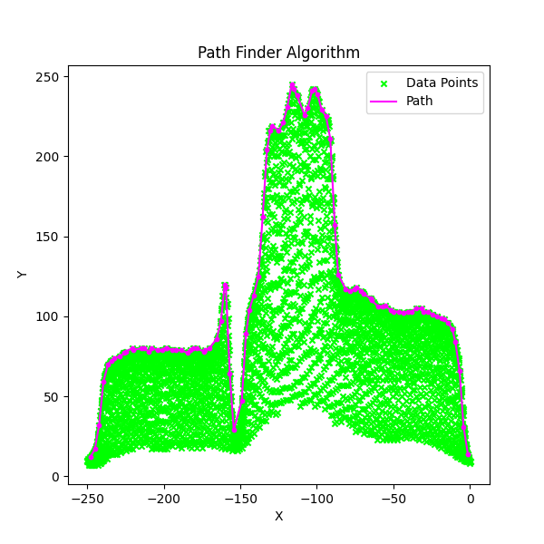
</div>
<p align="center">
Fig.7-5: The estimated peak path by the algorithm.
</p>


# Fluorescence localization visualizer 

<div align="center">

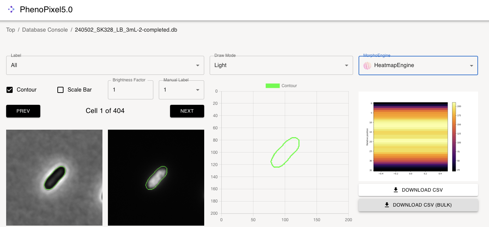
</div>


You can find the “Download Bulk” button after switching the morphoengine to the heatmapengine. Once you’ve downloaded the CSV file, you can run the following scripts to visualize the fluorescence localization of each cell in a single figure.

[Scripts for heatmap_rel](https://github.com/ikeda042/PhenoPixel5.0/blob/main/demo/get_heatmap_rel.py)

<div align="center">

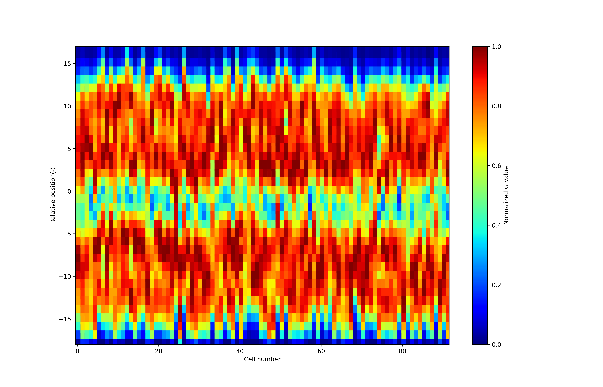
</div>


Note that cell lengths are normalized to relative positions so you can focus on localization. However, if you also need to consider the absolute lengths of the cells, you can run the following.

[Scripts for heatmap_abs](https://github.com/ikeda042/PhenoPixel5.0/blob/main/demo/get_heatmap_abs.py)

<div align="center">


</div>


[Scripts for heatmap_abs_centered](https://github.com/ikeda042/PhenoPixel5.0/blob/main/demo/get_heatmap_abs_centered.py)

<div align="center">


</div>