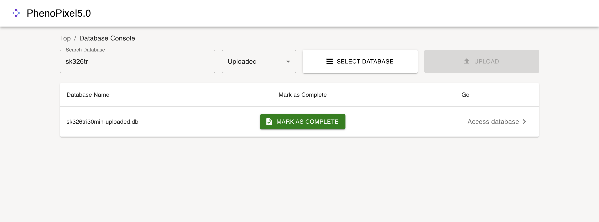
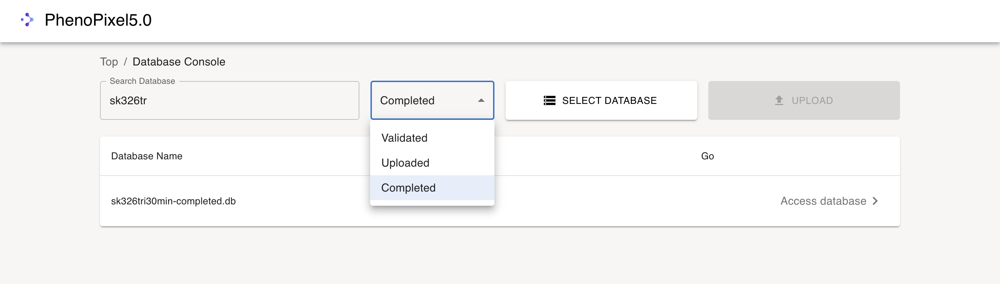

# PhenoPixel5.0
An OpenCV Based High-throughput image analysis program (API)

# Old version 

This version 5.0 inherits the deprecated version [PhenoPixel 4.0](https://github.com/ikeda042/PhenoPixel4.0)

# Setup 

This program presupposes that Node.js and Python 3.10 are installed on the user's computer


## start up back-end

```bash
cd backend/app
pip install -r requiremetns.txt
python main.py
```

## start up front-end

```bash
cd frontend
npm start
```

# User Interface

The startup screen shows up after activating the front end. 
   


## Cell Extraction

This section allows you to extract cells from arbitrary ND2 files that consist of up to three layers (e.g., PH, GFP, and YFP).

1. The first thing you will see in this section is the ND2 table shown below.
   
   First, you need to upload an ND2 file from your computer using the `SELECT ND2 FILE` button.
   

2. After selecting an ND2 file to upload, press the `UPLOAD` button to actually submit the file to the backend. This process takes approximately 30 seconds.
   
   If the file is successfully submitted, a pop-up alert will appear like this, and the filename will be added to the list as well.
   

3. The next step is to press the `EXTRACT CELLS` button.
   

4. After entering the cell extraction section, you will see the parameter input fields.
   
   Press the `EXTRACT CELLS` button when you have finished inputting all the parameters, and the cell extraction process will begin on the backend. This will take approximately 1 minute.

   <!-- Add parameter descriptions here. -->
5. When all processes are finished, detected cell contours will appear on the PH image with frames extracted from the input ND2 file. This is where you can check if the contour detection was successful. If not, you can adjust the parameters and press the `RE-EXTRACT CELLS` button. If everything looks fine, press the `GO TO DATABASE` button to proceed to the next step, which is labeling each cell.
   

6. After moving on to the section below the cell extraction section, you can access the database with the same prefix as the input ND2 file. The automatically generated database contains all the cell information and is renamed with the postfix `-uploaded` as a tag. The `Mark as Complete` button is disabled at this point because all the extracted cells are labeled as `N/A`.
   

7. When you press the `ACCESS DATABASE` button, you will see the cell labeling section as shown below.
   
   In this section, you can label all the cells extracted from the previous section with labels ["N/A", "1", "2", "3"]. You can also input these labels from the keyboard using ["n", "1", "2", "3"], and "Enter" corresponds to the "Next" UI button. Note that labels for each cell are automatically updated on the backend as soon as you select one in the list.

8. After labeling all the cells with arbitrary labels, you can go back to the `Database console` to find that the `Mark as Complete` button is enabled. 
   
   When you mark the database as complete, the database name is renamed to a new one with `-completed` as a postfix.

# Data Analyses

After obtaining the cell database with selected labels for each cell, in other words, after pressing `mark as completed`, it will show up in the `completed` section of the console. (Note that the `Validated` tag is only for admin usage (i.e., uncontrollable from the frontend))
   

When you press the `Access database` button, you will go to a similar section as the cell labeling console. (It is actually the same but without the labeling function.)
   

The next action you will take is to select the cells with a specific label in the list. 
   

   In this example, we will be using cells labeled with `1` as shown below.
   

## Parameters 

If you uncheck both the `Contour` and `Scale bar` checkboxes, you will see the raw images of the cells. 
   

If you check both the `Contour` and `Scale bar` checkboxes, you will see the cell images with their contours and a scale bar. 
   

If you increase or decrease the `Brightness Factor`, you can adjust the brightness of each pixel to see the localization of the fluorescence, etc. 
   

The `Manual Label` section just shows you the label of the cell and never updates it in this section because the labeling process is already done beforehand.

## Graph Section

There is a graph section in the middle column, which is set to `Light` as the default value. It shows the contour of the cell with its center at the center of the figure.
   

The draw modes consist of these three modes:


If you choose `Replot`, it shows the replotted figure of the cell. 


If you choose `Peak-path`, it shows the peak-path figure of the cell. 


`Polyfit degree` is a meta-parameter for the polynomial fitting of the cell center curve, but it is generally good practice to leave it at four.

# Morphoengines 

There are four Morphoengines that conduct morphological analyses of the cells.


If you choose `Morphoengine 2.0`, it shows you the morphological parameters for each cell. 
(The volume calculation algorithms are a work in progress.)


If you choose `MedianEngine`, it shows you the normalized median of the pixels inside the cell, highlighted with a red dot, and the other blue dots are those cells labeled as `1` in this case.


`MeanEngine` performs a similar function but for the normalized mean of the pixels inside the cells.


`HeatmapEngine` qualitatively visualizes the localization of the fluorescence at relative positions from the edge of the cell.


    


# Algorithms for morphological analyses 

## Cell Elongation Direction Determination Algorithm

### Objective:
To implement an algorithm for determinating the direction of cell elongation.

### Methodologies: 

In this section, we consider the elongation direction determination algorithm with regard to the cell with contour shown in Fig.1 below. 

Scale bar is 20% of image size (200x200 pixel, 0.0625 µm/pixel)


<div align="center">

  

</div>

<p align="center">
Fig.1  <i>E.coli</i> cell with its contour (PH Left, Fluo-GFP Center, Fluo-mCherry Right)
</p>

Consider each contour coordinate as a set of vectors in a two-dimensional space:

$$\mathbf{X} = 
\left(\begin{matrix}
x_1&\cdots&x_n \\
y_1&\cdots&y_n 
\end{matrix}\right)^\mathrm{T}\in \mathbb{R}^{n\times 2}$$

The covariance matrix for $\mathbf{X}$ is:

$$\Sigma =
 \begin{pmatrix} V[\mathbf{X_1}]&Cov[\mathbf{X_1},\mathbf{X_2}]
 \\ 
 Cov[\mathbf{X_1},\mathbf{X_2}]& V[\mathbf{X_2}] \end{pmatrix}$$

where $\mathbf{X_1} = (x_1\:\cdots x_n)$, $\mathbf{X_2} = (y_1\:\cdots y_n)$.

Let's define a projection matrix for linear transformation $\mathbb{R}^2 \to \mathbb{R}$  as:

$$\mathbf{w} = \begin{pmatrix}w_1&w_2\end{pmatrix}^\mathrm{T}$$

Now the variance of the projected points to $\mathbb{R}$ is written as:
$$s^2 = \mathbf{w}^\mathrm{T}\Sigma \mathbf{w}$$

Assume that maximizing this variance corresponds to the cell's major axis, i.e., the direction of elongation, we consider the maximization problem of the above equation.

To prevent divergence of variance, the norm of the projection matrix is fixed at 1. Thus, solve the following constrained maximization problem to find the projection axis:

$$arg \max (\mathbf{w}^\mathrm{T}\Sigma \mathbf{w}), \|\mathbf{w}\| = 1$$

To solve this maximization problem under the given constraints, we employ the method of Lagrange multipliers. This technique introduces an auxiliary function, known as the Lagrange function, to find the extrema of a function subject to constraints. Below is the formulation of the Lagrange multipliers method as applied to the problem:

$$\cal{L}(\mathbf{w},\lambda) = \mathbf{w}^\mathrm{T}\Sigma \mathbf{w} - \lambda(\mathbf{w}^\mathrm{T}\mathbf{w}-1)$$

At maximum variance:
$$\frac{\partial\cal{L}}{\partial{\mathbf{w}}} = 2\Sigma\mathbf{w}-2\lambda\mathbf{w} = 0$$

Hence, 

$$ \Sigma\mathbf{w}=\lambda\mathbf{w} $$

Select the eigenvector corresponding to the eigenvalue where λ1 > λ2 as the direction of cell elongation. (Longer axis)

### Result:

Figure 2 shows the raw image of an <i>E.coli </i> cell and the long axis calculated with the algorithm.


<div align="center">

  

</div>

<p align="center">
Fig.2  <i>E.coli</i> cell with its contour (PH Left, Replotted contour with the long axis Right)
</p>