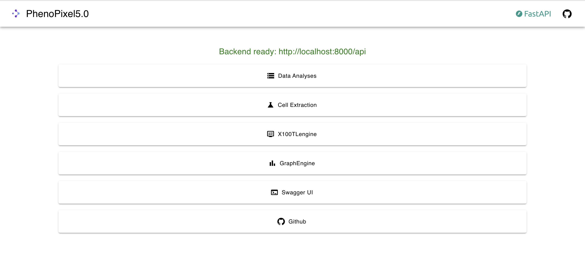
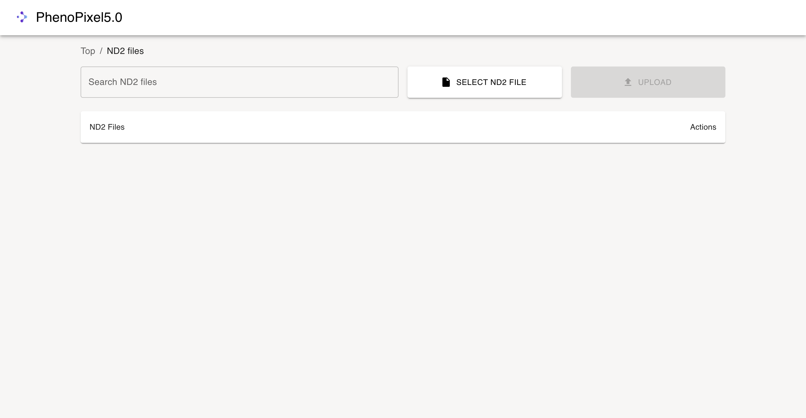
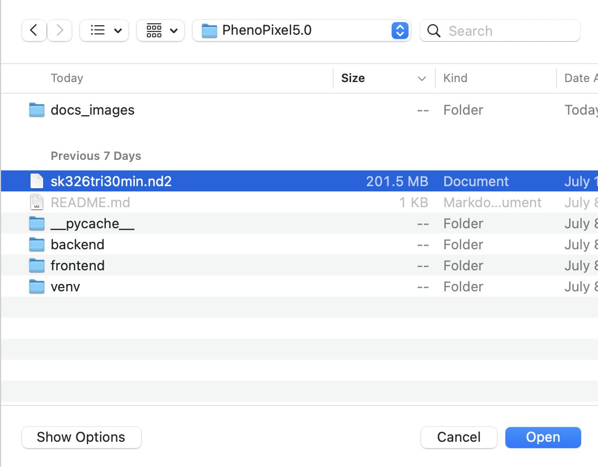
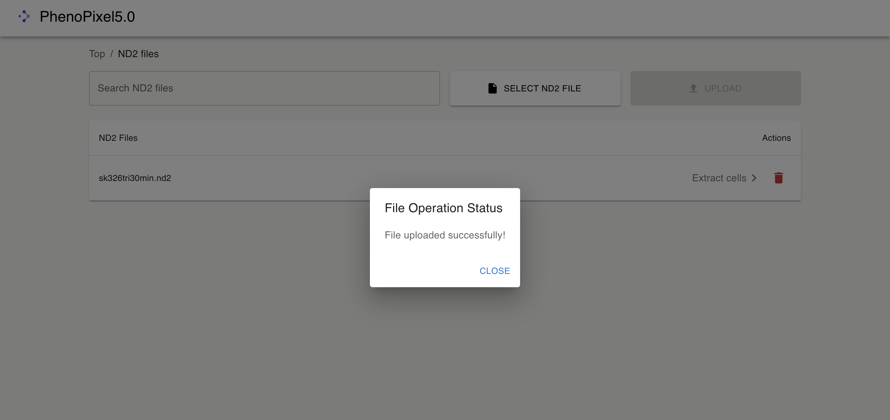

# PhenoPixel5.0
An OpenCV Based High-throughput image analysis program (API)

# Old version 

This version 5.0 inherits the deprecated version [PhenoPixel 4.0](https://github.com/ikeda042/PhenoPixel4.0)

# Setup 

This program presupposes that Node.js and Python 3.10 are installed on the user's computer


## start up back-end

```bash
cd backend/app
pip install -r requiremetns.txt
python main.py
```

## start up front-end

```bash
cd frontend
npm start
```

# User Interface

The startup screen shows up after activating the front end. 
   


## Cell extraction 

This section lets you extract cells from arbitrary nd2 files that consist of up to three layers (e.g., PH, GFP and YFP).

1. The first thing you will see in this section is the nd2 table shown below. 
   
first you need to upload an nd2 file from your computer with the `SELECT ND2 FILE` button. 
    

2. After selecting an nd2 file to upload, press `UPLOAD` button to actually submit the file to the backend. This process takes approximately 30 seconds or so. 
   
    
    If the file is successfully submitted, a pop up alert shows up like this, and the filename is added to the list as well.

    


    


# Algorithms for morphological analyses 

## Cell Elongation Direction Determination Algorithm

### Objective:
To implement an algorithm for determinating the direction of cell elongation.

### Methodologies: 

In this section, we consider the elongation direction determination algorithm with regard to the cell with contour shown in Fig.1 below. 

Scale bar is 20% of image size (200x200 pixel, 0.0625 µm/pixel)
