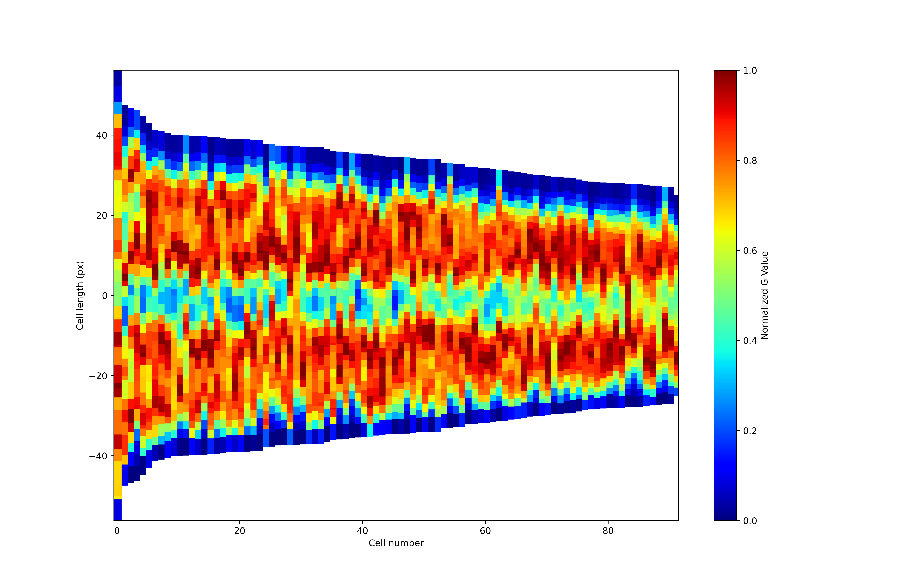

# PhenoPixel5.0
An OpenCV Based High-throughput image analysis program (API)

[日本語ドキュメント](README_JA.md)

# Old version 

This version 5.0 inherits the deprecated version [PhenoPixel 4.0](https://github.com/ikeda042/PhenoPixel4.0)

# Software Document

Available at : [Docs](Software_Docs.md)

# Algorithms for morphological analyses 

## Cell Elongation Direction Determination Algorithm

### Objective:
To implement an algorithm for determinating the direction of cell elongation.

### Methodologies: 

In this section, we consider the elongation direction determination algorithm with regard to the cell with contour shown in Fig.1 below. 

Scale bar is 20% of image size (200x200 pixel, 0.0625 µm/pixel)

  

Fig.1  <i>E.coli</i> cell with its contour (PH Left, Fluo-GFP Center, Fluo-mCherry Right)

Consider each contour coordinate as a set of vectors in a two-dimensional space:

$$\mathbf{X} = 
\left(\begin{matrix}
x_1&\cdots&x_n \\
y_1&\cdots&y_n 
\end{matrix}\right)^\mathrm{T}\in \mathbb{R}^{n\times 2}$$

The covariance matrix for $\mathbf{X}$ is:

$$\Sigma =
 \begin{pmatrix} V[\mathbf{X_1}]&Cov[\mathbf{X_1},\mathbf{X_2}]
 \\ 
 Cov[\mathbf{X_1},\mathbf{X_2}]& V[\mathbf{X_2}] \end{pmatrix}$$

where $\mathbf{X_1} = (x_1\:\cdots x_n)$, $\mathbf{X_2} = (y_1\:\cdots y_n)$.

Let's define a projection matrix for linear transformation $\mathbb{R}^2 \to \mathbb{R}$  as:

$$\mathbf{w} = \begin{pmatrix}w_1&w_2\end{pmatrix}^\mathrm{T}$$

Now the variance of the projected points to $\mathbb{R}$ is written as:
$$s^2 = \mathbf{w}^\mathrm{T}\Sigma \mathbf{w}$$

Assume that maximizing this variance corresponds to the cell's major axis, i.e., the direction of elongation, we consider the maximization problem of the above equation.

To prevent divergence of variance, the norm of the projection matrix is fixed at 1. Thus, solve the following constrained maximization problem to find the projection axis:

$$arg \max (\mathbf{w}^\mathrm{T}\Sigma \mathbf{w}), \|\mathbf{w}\| = 1$$

To solve this maximization problem under the given constraints, we employ the method of Lagrange multipliers. This technique introduces an auxiliary function, known as the Lagrange function, to find the extrema of a function subject to constraints. Below is the formulation of the Lagrange multipliers method as applied to the problem:

$$\cal{L}(\mathbf{w},\lambda) = \mathbf{w}^\mathrm{T}\Sigma \mathbf{w} - \lambda(\mathbf{w}^\mathrm{T}\mathbf{w}-1)$$

At maximum variance:

$$\frac{\partial\cal{L}}{\partial{\mathbf{w}}} = 2\Sigma\mathbf{w}-2\lambda\mathbf{w} = 0$$

Hence, 

$$ \Sigma\mathbf{w}=\lambda\mathbf{w} $$

Select the eigenvector corresponding to the eigenvalue where λ1 > λ2 as the direction of cell elongation. (Longer axis)

### Result:

Figure 2 shows the raw image of an <i>E.coli </i> cell and the long axis calculated with the algorithm.

  

Fig.2  <i>E.coli</i> cell with its contour (PH Left, Replotted contour with the long axis Right)

## Basis conversion Algorithm

### Objective:

To implement an algorithm for replacing the basis of 2-dimentional space of the cell with the basis of the eigenspace(2-dimentional).

### Methodologies:

Let 

$$ \mathbf{Q}  = \begin{pmatrix}
    v_1&v_2
\end{pmatrix}\in \mathbb{R}^{2\times 2}$$

$$\mathbf{\Lambda} = \begin{pmatrix}
    \lambda_1& 0 \\
    0&\lambda_2
\end{pmatrix}
(\lambda_1 > \lambda_2)$$

, then the spectral factorization of Cov matrix of the contour coordinates can be writtern as:

$$\Sigma =
 \begin{pmatrix} V[\mathbf{X_1}]&Cov[\mathbf{X_1},\mathbf{X_2}]
 \\ 
 Cov[\mathbf{X_1},\mathbf{X_2}]& V[\mathbf{X_2}] \end{pmatrix} = \mathbf{Q}\mathbf{\Lambda}\mathbf{Q}^\mathrm{T}$$

Hence, arbitrary coordinates in the new basis of the eigenbectors can be written as:

$$\begin{pmatrix}
    u_1&u_2
\end{pmatrix}^\mathrm{T} = \mathbf{Q}\begin{pmatrix}
    x_1&y_1
\end{pmatrix}^\mathrm{T}$$

### Result:

Figure 3 shows contour in the new basis 

$$\begin{pmatrix}
    u_1&u_2
\end{pmatrix}$$ 

  

Fig.3  Each coordinate of contour in the new basis (Right). 

## Cell length calculation Algorithm

### Objective:

To implement an algorithm for calculating the cell length with respect to the center axis of the cell.

### Methodologies:

<i>E.coli</i> expresses filamentous phenotype when exposed to certain chemicals. (e.g. Ciprofloxacin)

Figure 4 shows an example of a filamentous cell with Ciprofloxacin exposure. 

  

Fig.4 A filamentous <i>E.coli</i> cell (PH Left, Fluo-GFP Center, Fluo-mCherry Right).

Thus, the center axis of the cell, not necessarily straight, is required to calculate the cell length. 

Using the aforementioned basis conversion algorithm, first we converted the basis of the cell contour to its Cov matrix's eigenvectors' basis.

Figure 5 shows the coordinates of the contour in the eigenspace's bases. 

  

Fig.5 The coordinates of the contour in the new basis (PH Left, contour in the new basis Right).

We then applied least aquare method to the coordinates of the contour in the new basis.

Let the contour in the new basis

$$\mathbf{C} = \begin{pmatrix}
    u_{1_1} &\cdots&\ u_{1_n} \\ 
    u_{2_1} &\cdots&\ u_{2_n} 
\end{pmatrix} \in \mathbb{R}^{2\times n}$$

then regression with arbitrary k-th degree polynomial (i.e. the center axis of the cell) can be expressed as:
$$f\hat{(u_1)} = \theta^\mathrm{T} \mathbf{U}$$

where 

$$\theta = \begin{pmatrix}
    \theta_k&\cdots&\theta_0
\end{pmatrix}^\mathrm{T}\in \mathbb{R}^{k+1}$$

$$\mathbf{U} = \begin{pmatrix}
    u_1^k&\cdots u_1^0
\end{pmatrix}^\mathrm{T}$$

the parameters in theta can be determined by normal equation:

$$\theta = (\mathbf{W}^\mathrm{T}\mathbf{W})^{-1}\mathbf{W}^\mathrm{T}\mathbf{f}$$

where

$$\mathbf{W} = \begin{pmatrix}
    u_{1_1}^k&\cdots&1 \\
     \vdots&\vdots&\vdots \\
     u_{1_n}^k&\cdots&1 
\end{pmatrix} \in \mathbb{R}^{n\times k +1}$$

$$\mathbf{f} = \begin{pmatrix}
    u_{2_1}&\cdots&u_{2_n}
\end{pmatrix}^\mathrm{T}$$

Hence, we have obtained the parameters in theta for the center axis of the cell in the new basis. (fig. 6)

Now using the axis, the arc length can be calculated as:

$$\mathbf{L} = \int_{u_{1_1}}^{u_{1_2}} \sqrt{1 + (\frac{d}{du_1}\theta^\mathrm{T}\mathbf{U})^2} du_1 $$

**The length is preserved in both bases.**

We rewrite the basis conversion process as:

$$\mathbf{U} = \mathbf{Q}^\mathbf{T} \mathbf{X}$$

The inner product of any vectors in the new basis $\in \mathbb{R}^2$ is 

$$ \|\mathbf{U}\|^2 = \mathbf{U}^\mathrm{T}\mathbf{U} = (\mathbf{Q}^\mathrm{T}\mathbf{X})^\mathrm{T}\mathbf{Q}^\mathbf{T}\mathbf{X} = \mathbf{X}^\mathrm{T}\mathbf{Q}\mathbf{Q}^\mathrm{T}\mathbf{X} \in \mathbb{R}$$

Since $\mathbf{Q}$ is an orthogonal matrix, 

$$\mathbf{Q}^\mathrm{T}\mathbf{Q} = \mathbf{Q}\mathbf{Q}^\mathrm{T} = \mathbf{I}$$

Thus, 

$$\|\mathbf{U}\|^2 = \|\mathbf{X}\|^2$$

Hence <u>the length is preserved in both bases.</u> 

### Result:

Figure 6 shows the center axis of the cell in the new basis (4-th polynominal).

  

Fig.6 The center axis of the contour in the new basis (PH Left, contour in the new basis with the center axis Right).

### Choosing the Appropriate K-Value for Polynomial Regression

By default, the K-value is set to 4 in the polynomial regression. However, this may not be sufficient for accurately modeling "wriggling" cells.

For example, Figure 6-1 depicts a cell exhibiting extreme filamentous changes after exposure to Ciprofloxacin. The center axis as modeled does not adequately represent the cell's structure.

  

Fig.6-1  An extremely filamentous cell. (PH Left, contour in the new basis with the center axis Right).

The center axis (in red) with K = 4 does not fit as well as expected, indicating a need to explore higher K-values (i.e., K > 4) for better modeling.

Figure 6-2 demonstrates fit curves (the center axis) for K-values ranging from 5 to 10.

Fig.6-2: Fit curves for the center axis with varying K-values (5 to 10).

As shown in Fig. 6-2, K = 8 appears to be the optimal value. 

However, it's important to note that the differences in calculated arc lengths across various K-values fall within the subpixel range.

Consequently, choosing K = 4 might remain a viable compromise in any case.

## Quantification of Localization of Fluorescence
### Objective:

To quantify the localization of fluorescence within cells.

### Methodologies:

Quantifying the localization of fluorescence is straightforward in cells with a "straight" morphology(fig. 7-1). 

  

Fig.7-1: An image of an <i>E.coli</i> cell with a straight morphology.

However, challenges arise with "curved" cells(fig. 7-2).

To address this, we capitalize on our pre-established equation representing the cellular curve (specifically, a quadratic function). 

This equation allows for the precise calculation of the distance between the curve and individual pixels, which is crucial for our quantification approach.

The process begins by calculating the distance between the cellular curve and each pixel. 

This is achieved using the following formula:

An arbitrary point on the curve is described as:
$$(u_1,\theta^\mathrm{T}\mathbf{U}) $$
The minimal distance between this curve and each pixel, denoted as 
$(p_i,q_i)$, is calculated using the distance formula:

$$D_i(u_1) = \sqrt{(u_1-p_i)^2+(f\hat{(u_1)} - q_i)^2}$$

Minimizing $D_i$ with respect to $u_1$ ensures orthogonality between the curve and the line segment joining $(u_1,\theta^\mathrm{T}\mathbf{U})$ and $(p_i,q_i)$ 

This orthogonality condition is satisfied when the derivative of $D_i$ with respect to $u_1$ is zero.

The optimal value of $u_1$, denoted as $u_{1_i}^\star$, is obtained by solving 

$$\frac{d}{du_1}D_i = 0\:\forall i$$

for each pixel  $(p_i,q_i)$. 

Define the set of solution vectors as 

$$\mathbf{U}^\star = \lbrace (u_{1_i}^\star,f\hat{(u_{1_i}^\star)})^\mathrm{T} : u_{1_i}^\star \in u_1 \rbrace \in \mathbb{R}^{2\times n}$$

, where $f\hat{(u_{1_i}^\star)}$ denotes the correspoinding function value.

It should be noted that the vectors in $\mathbf{U}^\star$ can be interpreted as the projections of the pixels $(p_i,q_i)$ onto the curve.

Define the set of projected vectors $\mathbf{P}^\star$ such that each vector in this set consists of the optimal parameter value $u_{1_i}^\star$ and the corresponding fluorescence intensity, denoted by $G(p_i,q_i)$, at the pixel $(p_i,q_i)$. 

$$\mathbf{P}^\star = \lbrace (u_{1_i}^\star,G(p_i,q_i))^\mathrm{T} : u_{1_i}^\star \in u_1 \rbrace \in \mathbb{R}^{2\times n}$$

**Peak Path Finder Algorithm**

Upon deriving the set $\mathbf{P}^\star$, our next objective is to delineate a trajectory that traverses the 'peak' regions of this set. This trajectory is aimed at encapsulating the essential characteristics of each vector in $\mathbf{P}^\star$ while reducing the data complexity. 

To achieve this, we propose an algorithm that identifies critical points along the 'peak' trajectory. 

Initially, we establish a procedure to partition the curve into several segments. Consider the length of each segment to be $\Delta L_i$. The total number of segments, denoted as $n$, is determined by the condition that the sum of the lengths of all segments equals the arc length of the curve between two points $u_{1_1}$ and $u_{1_2}$. 

$$\sum_{i=0}^n \Delta L_i = \int_{u_{1_1}}^{u_{1_2}} \sqrt{1 + (\frac{d}{du_1}\theta^\mathrm{T}\mathbf{U})^2} du_1$$

Utilizing the determined number of segments $n$, we develop an algorithm designed to identify, within each segment $\Delta L_i$, a vector from the set $\mathbf{P}^\star$ that exhibits the maximum value of the function $G(p_i,q_i)$. 

The algorithm proceeds as follows:
        
> $f\to void$ 
> for $i$ $\in$ $n$: 
> &nbsp;&nbsp;&nbsp;&nbsp;Define segment boundaries: $L_i$, $L_{i+1}$ 
> &nbsp;&nbsp;&nbsp;&nbsp;Initialize:  
> &nbsp;&nbsp;&nbsp;&nbsp;&nbsp;&nbsp;&nbsp;&nbsp;maxValue 
> $\leftarrow -\infty$ 
>  &nbsp;&nbsp;&nbsp;&nbsp;&nbsp;&nbsp;&nbsp;&nbsp;maxVector $\leftarrow \phi$  
> &nbsp;&nbsp;&nbsp;&nbsp;for $\mathbf{v} \in \mathbf{P}^\star$ within $(L_i, L_{i+1})$: 
> &nbsp;&nbsp;&nbsp;&nbsp;&nbsp;&nbsp;&nbsp;&nbsp;if $G(p_i, q_i)$ of $\mathbf{v}$ > maxValue: 
> &nbsp;&nbsp;&nbsp;&nbsp;&nbsp;&nbsp;&nbsp;&nbsp;&nbsp;&nbsp;&nbsp;&nbsp;maxValue $\leftarrow G(p_i, q_i)$ of $\mathbf{v}$ 
> &nbsp;&nbsp;&nbsp;&nbsp;&nbsp;&nbsp;&nbsp;&nbsp;&nbsp;&nbsp;&nbsp;&nbsp;maxVector $\leftarrow \mathbf{v}$ 
> if maxVector $\neq \phi$ : 
> &nbsp;&nbsp;&nbsp;&nbsp;Add maxVector to the result set

### Results:

We applied the aforementioned algorithm for the cell shown in figure 7-2.

  

Fig.7-2: An image of a "curved" <i>E.coli</i> cell.

Figure 7-3 shows all the projected points on the center curve.

  

Fig.7-3: All the points(red) projected onto the center curve(blue).

Figure 7-4 depicts the result of projection onto the curve.

  

Fig.7-4: Projected points (red) onto the center curve.

Figure 7-5 describes the result of the peak-path finder algorithm.

Fig.7-5: The estimated peak path by the algorithm.

# Normalization Based on the Major Axis of Cell Morphology

In the previous chapter, we analytically derived the centerline of the cell. Utilizing this, we attempted to "stretch" any curved cell along its major axis to create a straightened cell, thereby normalizing the fluorescence localization within the cell.

First, let a curve represented by a polynomial in $$(u_1,u_2)$$ coordinates be expressed as $$f(\hat{u_1})=\theta^\mathrm{T}\mathbf{U}$$ 

At this point, the coordinates when projecting each pixel within the cell onto this curve can be expressed as follows:

$$\mathbf{U}^\star = \lbrace (u_{1_i}^\star,f\hat{(u_{1_i}^\star)})^\mathrm{T} : u_{1_i}^\star \in u_1 \rbrace \in \mathbb{R}^{2\times n}$$

Here, let $\mathbf{L}(u_1)$ be a function that calculates the arc length between $min(u_1)$ and any point $(u_1, f(\hat{u_1}))$ on the curve. Then, the information of the "stretched" cell can be expressed as follows:

$$\mathbf{C}^\star = \lbrace (u_{1_i}^\star,\mathbf{L}(u_{1_i}^\star))^\mathrm{T} : u_{1_i}^\star \in u_1 \rbrace \in \mathbb{R}^{2\times n}$$

> &nbsp;&nbsp;&nbsp; $\mathbf{C}^\star \leftarrow \emptyset$  
> &nbsp;&nbsp;&nbsp;&nbsp; for $i$ $\in$ $n$:  
> &nbsp;&nbsp;&nbsp;&nbsp;&nbsp;&nbsp;&nbsp;&nbsp; Retrieve coordinates: $(u_{1_i}^\star, f(\hat{u_{1_i}^\star}))$ from $\mathbf{U}^\star$  
> &nbsp;&nbsp;&nbsp;&nbsp;&nbsp;&nbsp;&nbsp;&nbsp; Calculate arc length:  
> &nbsp;&nbsp;&nbsp;&nbsp;&nbsp;&nbsp;&nbsp;&nbsp;&nbsp;&nbsp;&nbsp;&nbsp; $L(u_{1_i}^\star) \leftarrow \int_{min(u_1)}^{u_{1_i}^\star} \sqrt{1 + \left(\frac{df}{du_1}\right)^2} , du_1$  
> &nbsp;&nbsp;&nbsp;&nbsp;&nbsp;&nbsp;&nbsp;&nbsp; Create new coordinate:  
> &nbsp;&nbsp;&nbsp;&nbsp;&nbsp;&nbsp;&nbsp;&nbsp;&nbsp;&nbsp;&nbsp;&nbsp; $(u_{1_i}^\star, L(u_{1_i}^\star))$  
> &nbsp;&nbsp;&nbsp;&nbsp;&nbsp;&nbsp;&nbsp;&nbsp; Add new coordinate to $\mathbf{C}^\star$:  
> &nbsp;&nbsp;&nbsp;&nbsp;&nbsp;&nbsp;&nbsp;&nbsp;&nbsp;&nbsp;&nbsp;&nbsp; $\mathbf{C}^\star \leftarrow \mathbf{C}^\star \cup {(u_{1_i}^\star, L(u_{1_i}^\star))}$  
return $\mathbf{C}^\star$

This set represents a collection of points in $\mathbb{R}^{2 \times n} $, where each point $(u_{1_i}^\star, \mathbf{L}(u_{1_i}^\star))^\mathrm{T} $ is constructed from the parameter $ u_{1_i}^\star $ and its corresponding function value $ \mathbf{L}(u_{1_i}^\star)$.

To mathematically express the bounding rectangle encompassing $ \mathbf{C}^\star $, we can define it as follows:

- The horizontal bounds (in the $u_1$ direction) are defined by:

$$
u_{1_{\min}}^\star = \min \{ u_{1_i}^\star : u_{1_i}^\star \in u_1 \}
$$

$$
u_{1_{\max}}^\star = \max \{ u_{1_i}^\star : u_{1_i}^\star \in u_1 \}
$$

- The vertical bounds (in the $ \mathbf{L}(u_1) $ direction) are defined by:

$$
L_{\min} = \min \{ \mathbf{L}(u_{1_i}^\star) : u_{1_i}^\star \in u_1 \}
$$

$$
L_{\max} = \max \{ \mathbf{L}(u_{1_i}^\star) : u_{1_i}^\star \in u_1 \}
$$

The bounding rectangle $ R $ that encompasses $ \mathbf{C}^\star $ can be expressed as:

$$
R = [u_{1_{\min}}^\star, u_{1_{\max}}^\star] \times [L_{\min}, L_{\max}]
$$

If we treat $R$ as an image with dimensions $m \times n$, resizing it to $64 \times 64$ pixels using nearest-neighbor interpolation can be expressed mathematically as follows:

**Original pixel positions**: $ (x, y) $ where $ x \in \{0, 1, \ldots, n-1\} $ and $ y \in \{0, 1, \ldots, m-1\} $ 

**New pixel positions**: $ (x', y') $where $x' \in \{0, 1, \ldots, 63\} $ and $ y' \in \{0, 1, \ldots, 63\} $

The mapping from the original image to the resized image is given by:

$$
x' = \left\lfloor \frac{x \cdot 64}{n} \right\rfloor, \quad y' = \left\lfloor \frac{y \cdot 64}{m} \right\rfloor
$$

where $ \lfloor \cdot \rfloor $ denotes the floor function, which truncates the value to the nearest integer. The interpolation method `cv2.INTER_NEAREST` ensures that the pixel value chosen for each $ (x', y') $ corresponds to the nearest pixel from the original image.

### Results:

We applied the cell-streching algorithms for the cell shown in figure 8-1.

Fig. 8-1 a raw fluo image of a curved cell with its contour(light green).

Figure 8-2 shows the streched cell. 

Fig. 8-2 the pixels within stretched cell.

Figure 8-3 shows the reconstructed cell image as n x m matrix.

Fig. 8-3 the reconstructed cell image as n x m matrix.

Figure 8-4 shows the map64 image of the cell. 

Fig. 8-4 the map64 image of the cell. (64 x 64)

# Fluorescence localization visualizer 

You can find the “Download Bulk” button after switching the morphoengine to the heatmapengine. Once you’ve downloaded the CSV file, you can run the following scripts to visualize the fluorescence localization of each cell in a single figure.

[Scripts for heatmap_rel](https://github.com/ikeda042/PhenoPixel5.0/blob/main/demo/get_heatmap_rel.py)

Fig. 9-1 staked heatmap with normalized cell lengths.

Note that cell lengths are normalized to relative positions so you can focus on localization. However, if you also need to consider the absolute lengths of the cells, you can run the following.

[Scripts for heatmap_abs](https://github.com/ikeda042/PhenoPixel5.0/blob/main/demo/get_heatmap_abs.py)

(in pixel)

Fig. 9-2 staked heatmap with absolute cell lengths.(in pixel)

[Scripts for heatmap(centered)](https://github.com/ikeda042/PhenoPixel5.0/blob/main/demo/get_heatmap_centered.py)

Fig. 9-3 staked heatmap with absolute cell lengths. (in µm)

# Phenotipic expression patterns with map64

[Scripts for map64 normalization](experimental/DotPatternMap/main.py)

With the Map64 normalization algorighms, cells' phenotipic GFP-expressions patterns. 

Here is the example of the antibiotic treated population.

Fig. 10-1 Streched cells of the population with fluorescent information.

Fig. 10-2 Map64 normalized cells of the population.

