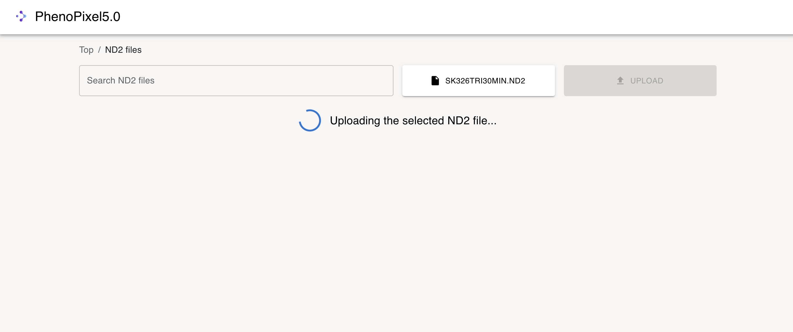
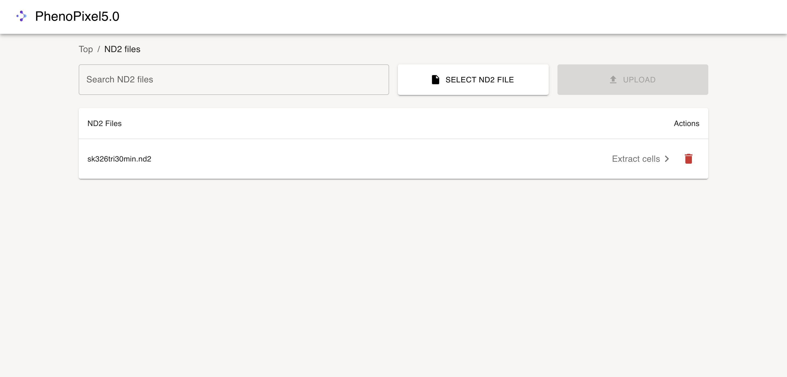
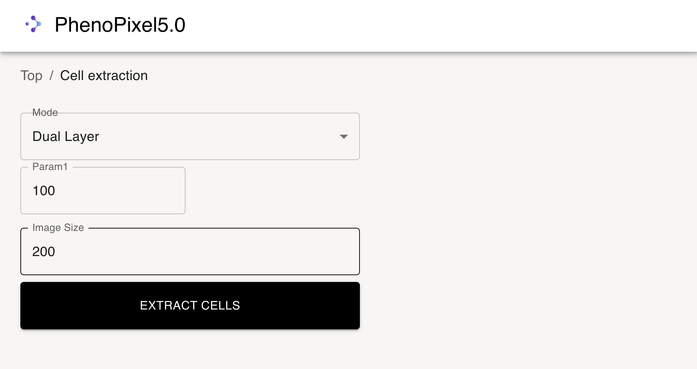

# 使い方

1. スタートアップスクリーン
    

2. `CELL EXTRACTION`を選択すると下記画面に遷移する。
     
   
3. `SELECT ND2 FIlE`を押して任意のnd2ファイルを選択する。
    

4. ファイル選択後に右側の`UPLOAD`ボタンを押すと下記のようにアプリケーションにファイルが送信される。(1分ほどかかる)
     

    アップロードが成功すると下記のようなダイアログが出る。

    

5. アップロードしたnd2ファイルが下記のようにテーブルに追加されるため、任意のnd2ファイルの`Extract cells`を選択する。
     

6.  パラメータ入力フィールドに移動するので、任意のパラメータを入力して、`EXTRACT CELLS`ボタンを押す。
    
    この時、image sizeはフレームの切り抜き画像の大きさ,モードはND2ファイルのレイヤ数に対応する。

7. 細胞抽出完了後は、すべての視野における結果を確認することができる。
    

8. 抽出ができているようであれば、`GO TO DATBASES`へ進む。そうでなければパラメータ1 を調整する。(1-255)
