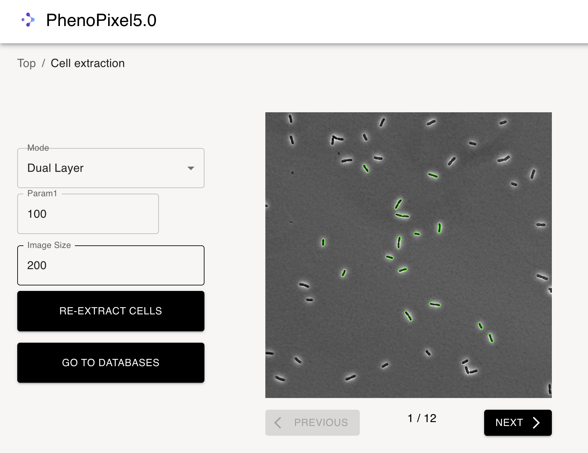
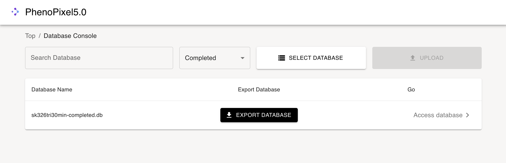
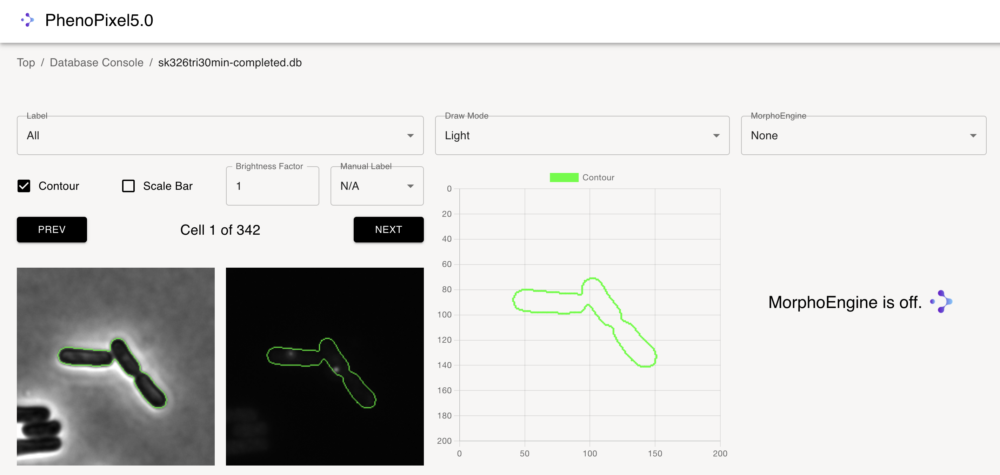
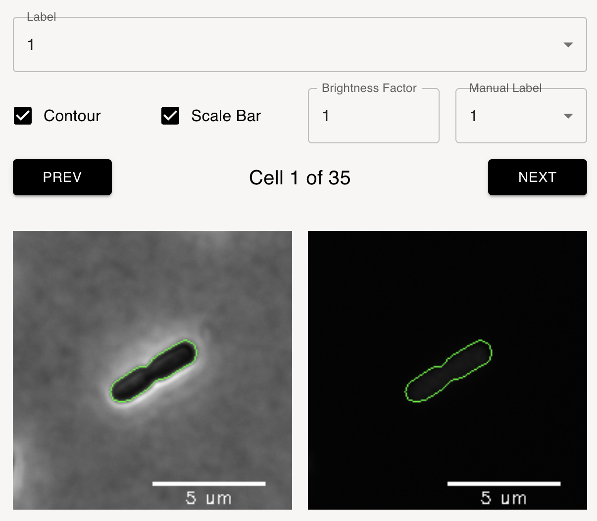
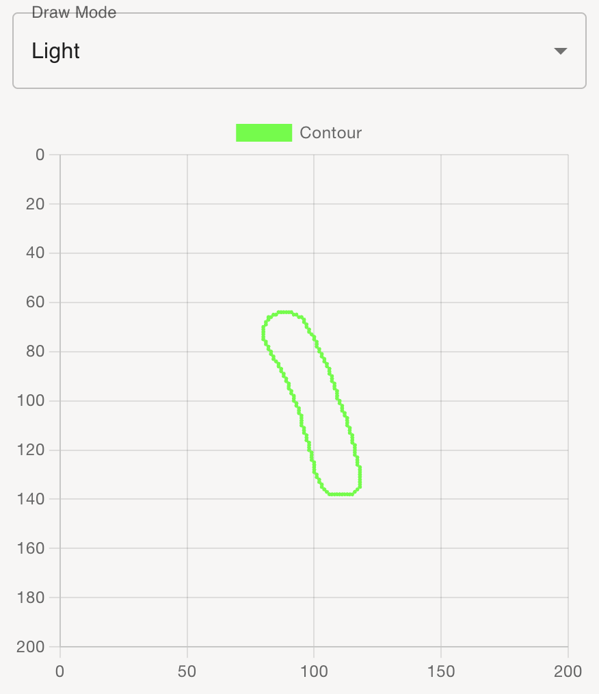
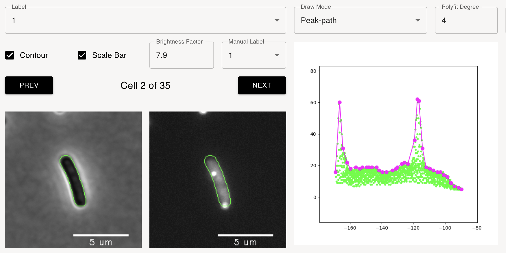
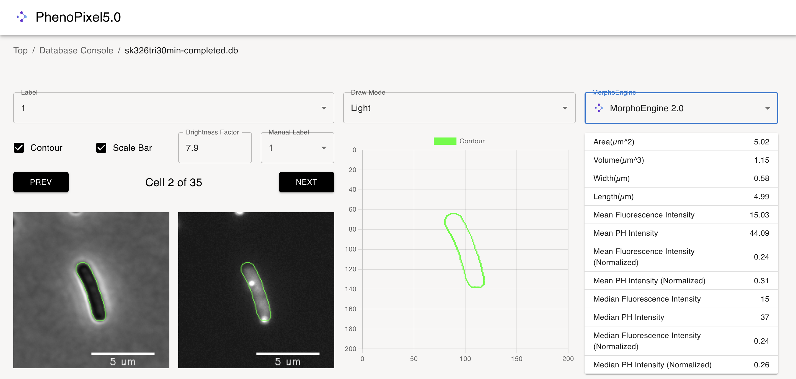

# 使い方

1. スタートアップスクリーン
    

2. `CELL EXTRACTION`を選択すると下記画面に遷移する。
     
   
3. `SELECT ND2 FIlE`を押して任意のnd2ファイルを選択する。
    

4. ファイル選択後に右側の`UPLOAD`ボタンを押すと下記のようにアプリケーションにファイルが送信される。(1分ほどかかる)
     

    アップロードが成功すると下記のようなダイアログが出る。

    

5. アップロードしたnd2ファイルが下記のようにテーブルに追加されるため、任意のnd2ファイルの`Extract cells`を選択する。
     

6.  パラメータ入力フィールドに移動するので、任意のパラメータを入力して、`EXTRACT CELLS`ボタンを押す。
    
    この時、image sizeはフレームの切り抜き画像の大きさ,モードはND2ファイルのレイヤ数に対応する。

7. 細胞抽出完了後は、すべての視野における結果を確認することができる。
    

8. 抽出ができているようであれば、`GO TO DATBASES`へ進む。そうでなければパラメータ1 を調整する。(1-255)

9. `GO TO DATBASES`へ進むと下記のような画面になる。このデータベースには、抽出されたすべての細胞が`N/A`ラベルがついた状態で格納されている。
    

10. `Accesss database`へ進むことで、データベースの中身にアクセスできる。以下が遷移先である。
    
    このページにおいて、`Manual label`を選択することで、細胞にラベリングを行うことができる。(e.g., `N/A`は崩れた輪郭、`1`は綺麗に取れた輪郭など)
    ラベルを変更した時点でリアルタイムにデータベースの値が書き換わるため、`Database console`に途中で戻ってあとから帰ってくることも可能である。
    この画面で、細胞のPH,蛍光観察結果を保存することも可能である。`Brightness factor`は蛍光画像の輝度をn倍にすることができるため、結果の確認時に便利であるが、定性的な結果をエクスポートする場合は値を揃えるべきである。

11. ラベリング終了後、`Database console`に戻ると、`Mark as comlete`ボタンが押せるようになっている。このボタンを押すことで、今後データベースの書き換えが不可能となる。
     

12. `Mark as comlete`を押した後は、下記のように、`completed`タグがついたデータベースに追加される。この時点で、ラベル付き細胞が格納されたデータベースを`EXPORT DATABASE`からダウンロードして退避させ保管しておくことも可能である。
    
    
   
# データ解析

1. 上述の方法で細胞抽出が完了したら、下記のようにラベル付き細胞が格納されたデータベースがリストに追加されている。
    

2. `Access database`へ進むと、下記のような画面に遷移する。（これはラベル付けの際の画面とほとんど同じである。）
    

3. ここで、`Labels` を変更することで、選択したラベルが付与された細胞集団のみを取得することができる。

    
    
    本項では下記のようにラベル`1`の細胞集団を取得する。
    

4. 操作パネル(画面左側)について、`Contour（輪郭）`,`Scale bar`があり、
    

    両方にチェックを入れると、下記のように画像に自動的に描画される。

    

    また、 `Brightness factor(先述)`をあげると蛍光画像の輝度が単純にN倍になる。

    

    `Manual label`については、データベースのステータスが`completed`になっているため、変更できない。

5. 操作パネル(中央)はグラフ描画セクションであり、デフォルトでは`Light(軽量)`モードになっている。
    
   
   描画モードは下記の３種類ある。

   

    `Replot`を選択すると、細胞内蛍光輝度情報を再構築したデータポイントが得られる。

    

    `Peak-path`を選択すると、3次元輝度情報を長軸ベースに圧縮した上で算出したpeak-pathが得られる。

    

    `polyfid degree`は細胞長軸の多項式回帰に使用するkの値であるが、4のままで問題ない。

6. 操作パネル(画面右)は形態解析エンジンであり現在以下の４つのエンジンを搭載している。
     

    `Morphoengine 2.0`は以下のように細胞の基本的な形態情報を計算することができる。（現在、体積、幅の算出方法に問題ありのため改修中)

    

    `MedianEngine`は今回はラベル`1`の細胞集団を選択しているため、それらすべての細胞集団の各細胞内の蛍光輝度の中央値を正規化したものを計算する。

    

    この時、赤いデータポイントが現在選択している細胞で青いデータポイントはそれ以外のラベル`1`の細胞集団におけるそれぞれの値である。

   ` Download CSV`を押すことで、ラベル`1`の細胞集団における上記の計算結果がすべて出力される。

   

